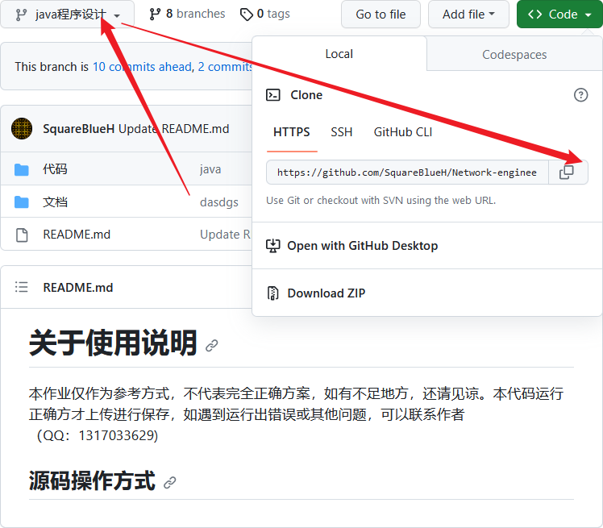
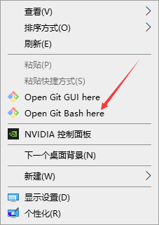
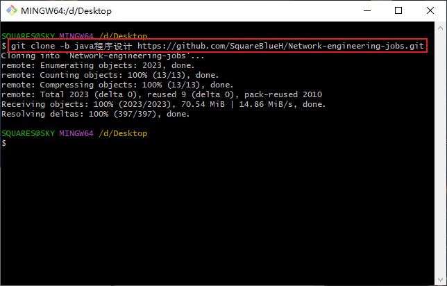

# 关于使用说明
本作业仅作为参考方式，不代表完全正确方案，如有不足地方，还请见谅。本代码运行正确方才上传进行保存，如遇到运行出错误或其他问题，可以联系作者（QQ：`1317033629`)

✅Android应用开发与设计

✅JSP程序设计

✅Java程序设计

❎JavaWeb企业及开发

✅数据库系统原理

✅数据结构与算法

✅网页设计

## 文件下载

1. 请认准下载仓库`分支的名称`

   

2. 桌面右键打开`Open Git Bash here`

   

3. 运行代码下载指定分支，演示`java程序设计`

   ```
   git clone -b java程序设计 https://github.com/SquareBlueH/Network-engineering-jobs.git
   ```
   
   


