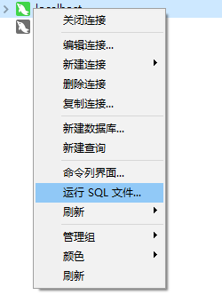
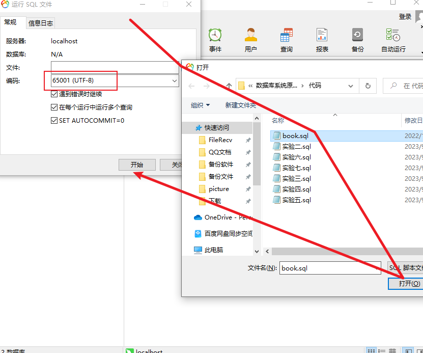
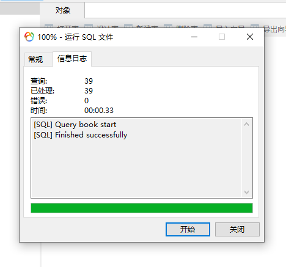

# 关于使用说明
本作业仅作为参考方式，不代表完全正确方案，如有不足地方，还请见谅。本代码运行正确方才上传进行保存，如遇到运行出错误或其他问题，可以联系作者（QQ：`1317033629`)

由于分支比较大，针对下载缓慢的网友，[点击此处](https://wwlh.lanzouw.com/b052kc6xe )。~~如已解决，请忽略以上消息。~~

网盘统一密码：`1111`

请注意❗❗❗本项目仅供学习使用，不得用于商用目的或其他不良行为。如需进行其他用途，请遵循相关的法律法规并获得相关授权。

## 源码操作方式

操作系统：`Windows10/11`

项目需求：[mysql8.0](https://mp.weixin.qq.com/s/gxFRMD2ZmP8EgknaoRCdAQ)，~~如已解决，请忽略以上消息。~~

------

- 打开`Navicat Premium 12`软件，右键数据库连接点击`运行SQL文件`

  

找到下载好的文件地址打开即可

