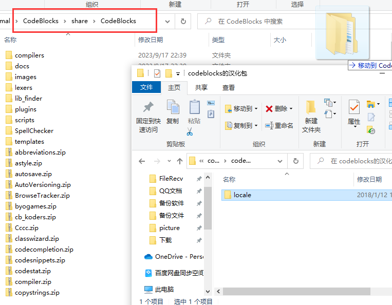
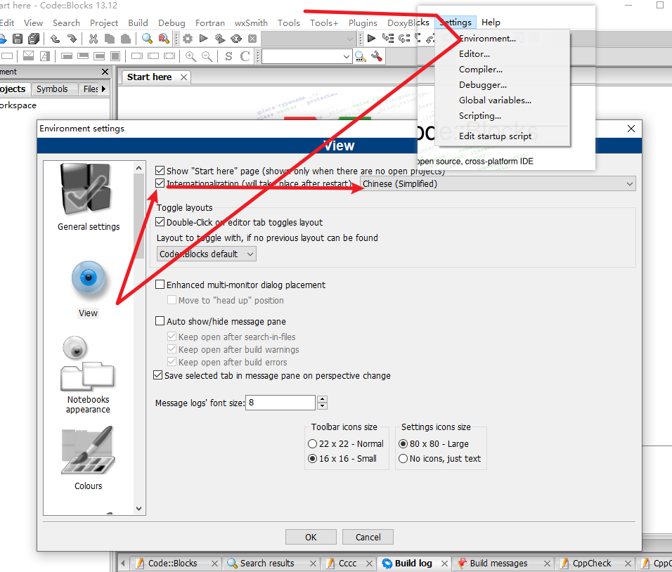

# 关于使用说明
本作业仅作为参考方式，不代表完全正确方案，如有不足地方，还请见谅。本代码运行正确方才上传进行保存，如遇到运行出错误或其他问题，可以联系作者（QQ：`1317033629`)

网盘统一密码：`1111`

请注意❗❗❗本项目仅供学习使用，不得用于商用目的或其他不良行为。如需进行其他用途，请遵循相关的法律法规并获得相关授权。

## 源码操作方式

操作系统：`Windows10/11`

项目需求：[CodeBlocks](https://wwlh.lanzouw.com/b052htcne )+[jdk1.8](https://mp.weixin.qq.com/s/Lyv2zPT1J6r4ef7qu9nRPw)~~如已解决，请忽略以上消息。~~

------

- 简略自建项目，代码复制进去即可，详细步骤暂时不声明。

- 如需汉化`CodeBlocks`软件，则解压汉化包，如图所示放在红框位置上。

  

然后重启即可
