# 关于使用说明
本作业仅作为参考方式，不代表完全正确方案，如有不足地方，还请见谅。本代码运行正确方才上传进行保存，如遇到运行出错误或其他问题，可以联系作者（QQ：`1317033629`)

## 文件下载

1. 本地建立文件夹

   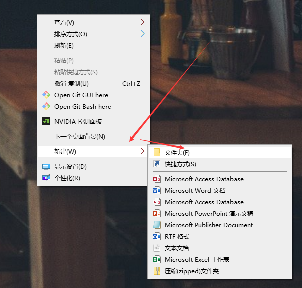

   例如建立文件夹hellowork

   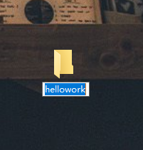

   鼠标双击文件夹，进入文件夹后右键进入Open Git Bash here

   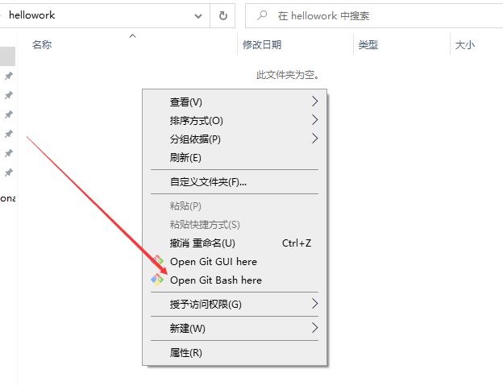

2. 输入`git init`进行初始化仓库，生成.git子目录，在新建的文件夹中可以查看。

   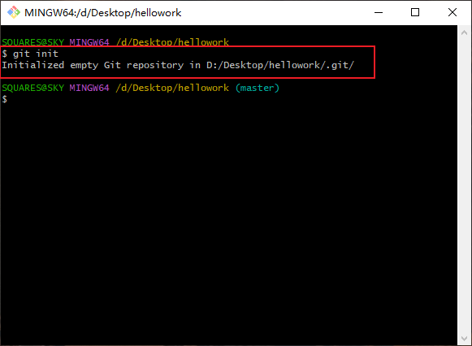

3. 从仓库复制项目链接，便于在git界面中复制。(<!--此处可以省略，本链接基本不会改变，下方已给出链接-->)

   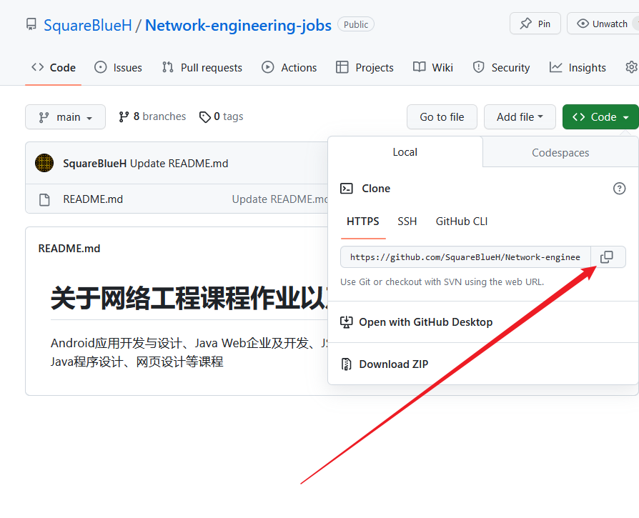

   然后返回git命令行界面输入`git remote add origin https://github.com/SquareBlueH/Network-engineering-jobs.git`，该指令为本地项目与远程仓库建立连接

   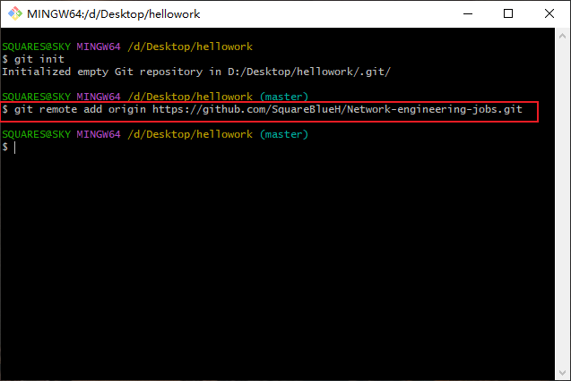

   接着需要合并分支，建立本地与远程分支的联系`git pull origin ok`

   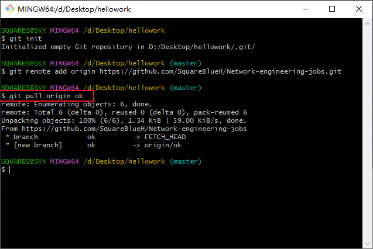

4. 添加本地文件到暂存区`git add .`

   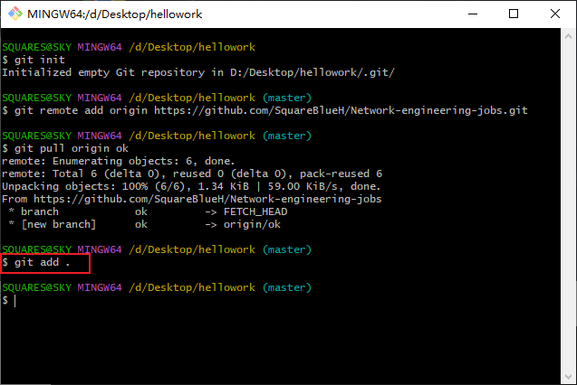

5. 将暂缓区添加到本地仓库.git中，提前预热。`git commit -m "起到记录事件功能，名称自拟"`

   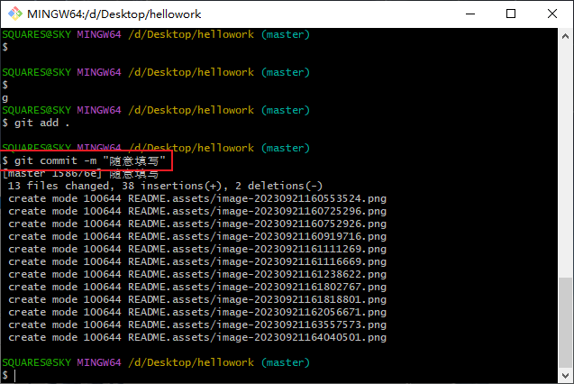

6. 创建本地分支，进行上传文件时需要切换到对应的分支。`git branch look`

   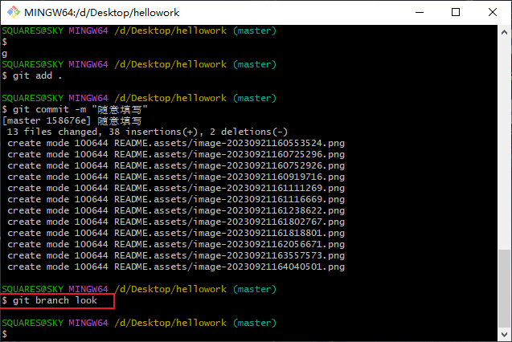

7. 切换分支，进行预准备上传文件`git checkout look`

   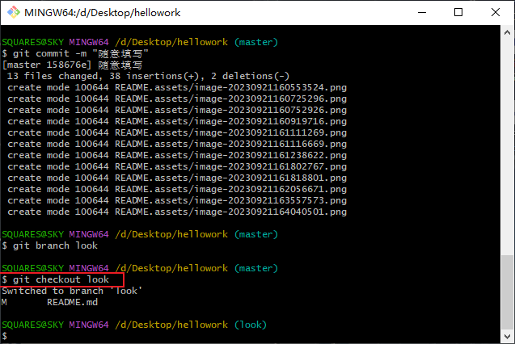

8. 最后进行上传文件`git push origin look`

   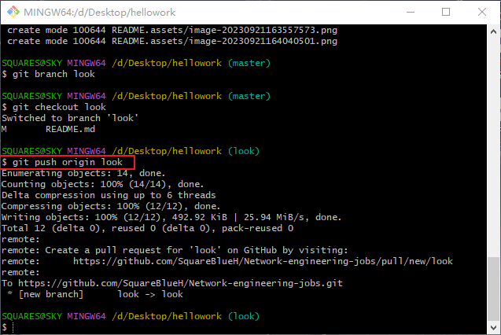

9. 最后在个人github即可看到上传成功

   

