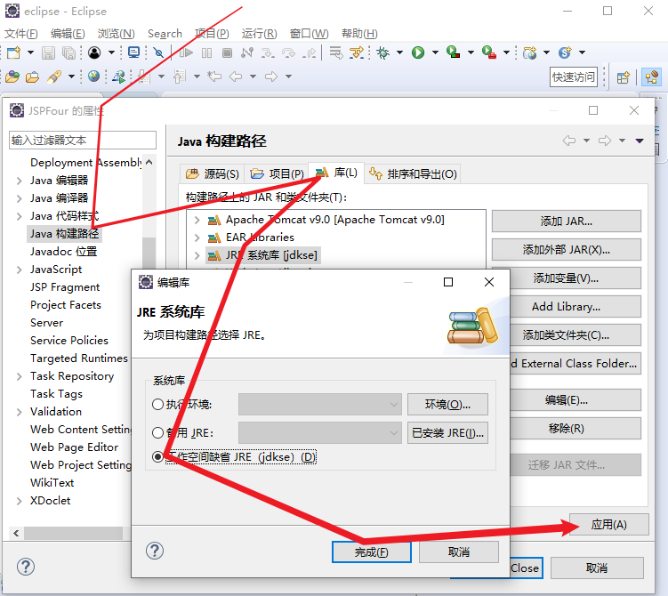

# 关于使用说明
本作业仅作为参考方式，不代表完全正确方案，如有不足地方，还请见谅。本代码运行正确方才上传进行保存，如遇到运行出错误或其他问题，可以联系作者（QQ：`1317033629`)

## 源码操作方式

##### 项目需求：[Tomcat9.0](链接：https://pan.baidu.com/s/1Elttf6hLMuvLTGH2yLV-LA?pwd=enw5 
提取码：enw5[)+[jdk1.8](https://mp.weixin.qq.com/s/UBQ90ELYbTLMPzeLQhYk2g)+[eclipse](https://mp.weixin.qq.com/s/UBQ90ELYbTLMPzeLQhYk2g)+[mysql8.0](https://mp.weixin.qq.com/s/UBQ90ELYbTLMPzeLQhYk2g)，只限制前[两项版本](https://tomcat.apache.org/whichversion.html)，~~如完成配置要求，则忽略此消息。~~

- 进入eclipse软件，点击导入

  

- 如遇到红叉显示，如图所示基本能解决问题。

  
