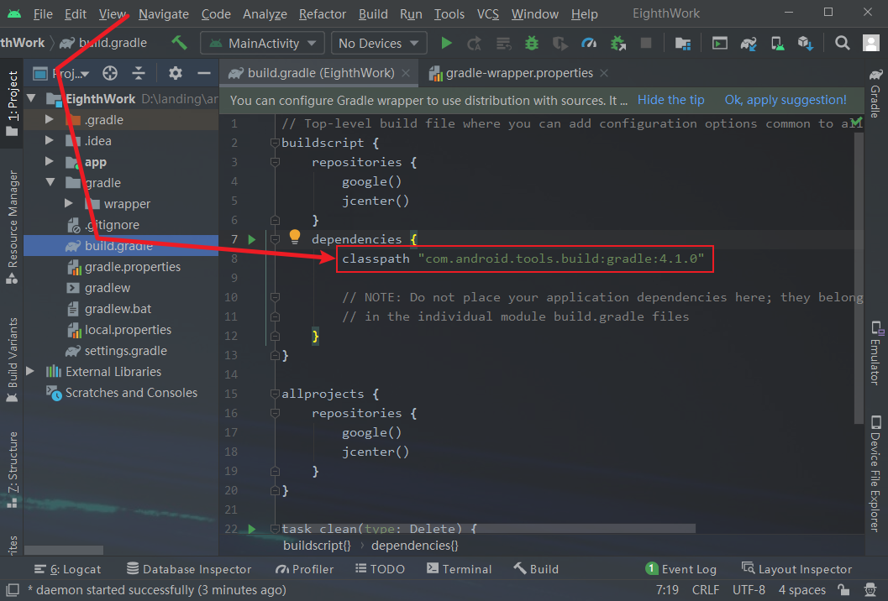

# 关于使用说明
本作业仅作为参考方式，不代表完全正确方案，如有不足地方，还请见谅。本代码运行正确方才上传进行保存，如遇到运行出错误或其他问题，可以联系作者（QQ：`1317033629`)

由于分支比较大，针对下载缓慢的网友，[点击此处](https://wwlh.lanzouw.com/iCLYz1biunla)。~~如已解决，请忽略以上消息。~~

网盘统一密码：`1111`

## 源码操作方式

操作系统：`Windows10/11`

项目需求：[AndroidStudio4.1](https://redirector.gvt1.com/edgedl/android/studio/install/4.1.0.19/android-studio-ide-201.6858069-windows.exe)（[安装文档](https://wwlh.lanzouw.com/iXDTC1biqf0h)）+[gradle6.5](https://wwlh.lanzouw.com/i71ug19ldhtg)（安装文档）

注意：本项目使用`AndroidStudio4.1`版本，如使用高版本`build.gradle、gradle-wrapper.properties`等文件无法修改，作者暂时找不到解决办法。~~如已解决，请忽略以上消息。~~

- 打开`代码文件夹`，例如进入`EighthWork`文件夹，打开`build.gradle`文件选择记事本。

  更换能正常运行的项目中`build.gradle`文件<!--注意：文件的位置-->

  

  

- 然后更换`grdle-wrapper`文件夹中`gradle-wrapper.properties`红框内容

- 最后把`EighthWork`文件夹直接拖到`AndroidStudio`启动界面即可

  
