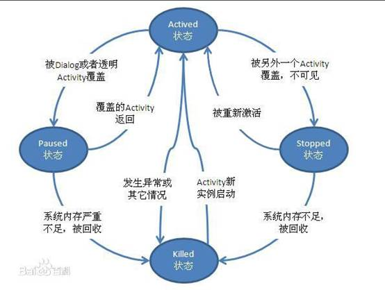
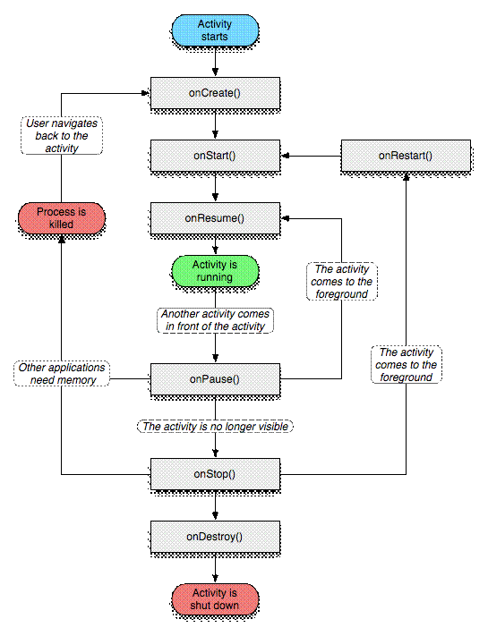

**1.Activity**

Activity是Android组件中最基本也是最为常见用的四大组件（Activity，Service服务,Content Provider内容提供者，BroadcastReceiver广播接收器）之一 。

Activity是一个应用程序[组件](http://baike.baidu.com/view/379950.htm)，提供一个屏幕，用户可以用来交互为了完成某项任务。

Activity中所有操作都与用户密切相关，是一个负责与**用户交互**的组件，可以通过setContentView(View)来**显示指定控件**。

在一个android应用中，一个Activity通常就是一个单独的屏幕，它上面可以显示一些控件也可以监听并处理用户的事件做出响应。Activity之间通过Intent进行通信。

基本状态

在[android](http://baike.baidu.com/subview/1241829/9322617.htm) 中，Activity 拥有四种基本状态：

\1.  **Active/Running**

一个新 Activity 启动入栈后，它显示在屏幕最前端，处理是处于栈的最顶端（Activity栈顶），此时它处于可见并可和用户交互的激活状态,叫做活动状态或者运行状态（active or running）。

2**.** **Paused**

当 Activity失去焦点， 被一个新的非全屏的Activity 或者一个透明的Activity 被放置在栈顶，此时的状态叫做暂停状态（Paused）。此时它依然与窗口管理器保持连接，Activity依然保持活力（保持所有的状态，成员信息，和窗口管理器保持连接），但是在系统内存极端低下的时候将被强行终止掉。所以它仍然可见，但已经失去了焦点故不可与用户进行交互。

3**. Stopped**

如果一个Activity被另外的Activity完全覆盖掉，叫做停止状态（Stopped）。它依然保持所有状态和成员信息，但是它不再可见，所以它的窗口被隐藏，当系统内存需要被用在其他地方的时候，Stopped的Activity将被强行终止掉。

4**. Killed**

如果一个Activity是Paused或者Stopped状态，系统可以将该Activity从内存中删除，Android系统采用两种方式进行删除，要么要求该Activity结束，要么直接终止它的进程。当该Activity再次显示给用户时，它必须重新开始和重置前面的状态。

状态转换

当一个 Activity 实例被创建、销毁或者启动另外一个 Activity 时，它在这四种状态之间进行转换，这种转换的发生依赖于用户程序的动作。下图说明了 Activity 在不同状态间转换的时机和条件：

**图1. Activity 的状态转换**

 

 

 

 

 

 

 

 

 

 

 

 

 

 

 

 

 

 

 

 

 

 

生命周期

 

1.启动Activity：系统会先调用onCreate方法，然后调用onStart方法，最后调用onResume，Activity进入运行状态。

 

2.当前Activity被其他Activity覆盖其上或被锁屏：系统会调用onPause方法，暂停当前Activity的执行。

3.当前Activity由被覆盖状态回到前台或解锁屏：系统会调用onResume方法，再次进入运行状态。

 

4.当前Activity转到新的Activity界面或按Home键回到主屏，自身退居后台：系统会先调用onPause方法，然后调用onStop方法，进入停滞状态。

 

5.用户后退回到此Activity：系统会先调用onRestart方法，然后调用onStart方法，最后调用onResume方法，再次进入运行状态。

 

6.当前Activity处于被覆盖状态或者后台不可见状态，即第2步和第4步，系统内存不足，杀死当前Activity，而后用户退回当前Activity：再次调用onCreate方法、onStart方法、onResume方法，进入运行状态。

 

7.用户退出当前Activity：系统先调用onPause方法，然后调用onStop方法，最后调用onDestory方法，结束当前Activity。

 

在上图中，Activity有三个关键的循环：

\1. 整个的生命周期，从[onCreate](http://baike.baidu.com/view/2270482.htm)(Bundle)开始到onDestroy()结束。Activity在onCreate()设置所有的“全局”状态，在onDestory()释放所有的资源。例如：某个Activity有一个在后台运行的线程，用于从网络下载数据，则该Activity可以在onCreate()中创建线程,在onDestory()中停止线程。

\2. 可见的生命周期，从onStart()开始到onStop()结束。在这段时间，可以看到Activity在屏幕上，尽管有可能不在前台，不能和用户交互。在这两个接口之间，需要保持显示给用户的[UI](http://baike.baidu.com/view/20302.htm)数据和资源等，例如：可以在onStart中注册一个IntentReceiver来监听数据变化导致UI的变动，当不再需要显示时候，可以在onStop()中注销它。onStart()，onStop()都可以被多次调用，因为Activity随时可以在可见和隐藏之间转换。

\3. 前台的[生命周期](http://baike.baidu.com/view/555124.htm)，从onResume()开始到onPause()结束。在这段时间里，该Activity处于所有 Activity的最前面，和用户进行交互。Activity可以经常性地在resumed和paused状态之间切换，例如：当设备准备休眠时，当一个 Activity处理结果被分发时，当一个新的Intent被分发时。所以在这些接口方法中的代码应该属于非常轻量级的。

 

Activity 跳转与数据传递

 

Android实现不同Active页面间的跳转,可以使用Intent对象。

假设在一个窗口Activity1中：

Intent intent = new Intent(); // 新建一个Intent对象

intent.putExtra("username",value); //将字符值入 Intent对象中

intent.setClass(Activity1.this, Activity2.class); //指定intent要启动的类

 Activity1.this.startActivity(intent);//启动一个新的Activity 

 

跳转到Activity2时获取传过来的值：   

Intent intent =getIntent() ;

String name=intent.getStringExtra("username"); 

 

若传递的数据很多，为简化页面间数据传递代码问题，可使用Bundle类先将数据打包，再将此对象放入Intent。

 

 