**Android Studio4.0****安装**

**一、jdk环境**

我们在下载好安装程序之后，最好先检查自己电脑的jdk版本，查看是否符合新版的Android Studio，毕竟新建项目的时候，如果某些库缺失的时候就会很麻烦了。查看方法：打开系统命令行，输入 java -version 即可。

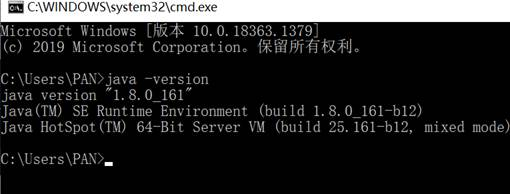

我这个基本是比较新的jdk版本了，要想下载安装可以到[官网](http://www.oracle.com/technetwork/java/javase/downloads/jdk8-downloads-2133151.html)直接下载。安装过程就略过了，基本是一路next，最好安装在C盘，因为也占不了多少空间，过程注意记录jdk和jre的安装路径，并在最后进入计算机 ->属性->高级系统设置->环境变量，新建系统变量 JAVA_HOME,并添加的值是C:\ProgramFiles\Java\jdk1.8.0_161，至此，Java 环境配置完成。

**二、Android Studio4.0安装**

 1、下载好AS安装包之后，点击进行安装，依次出现以下界面

https://www.androiddevtools.cn/

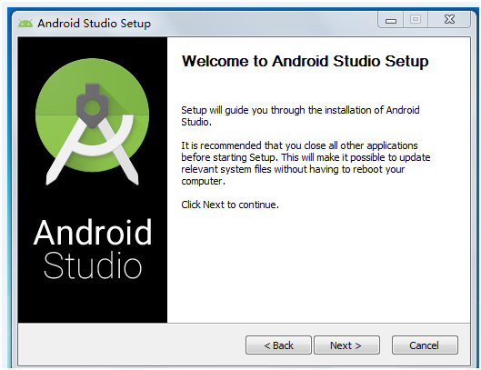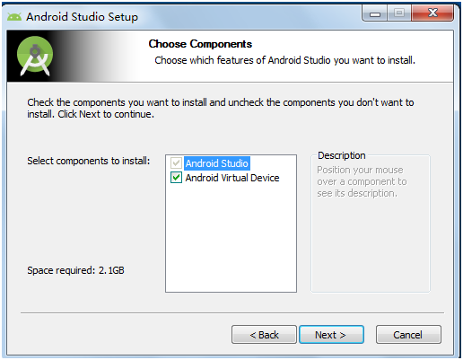

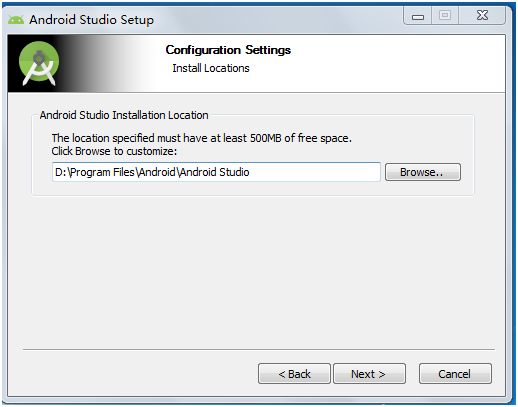

在这里自己选择程序安装路径

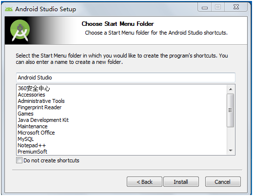

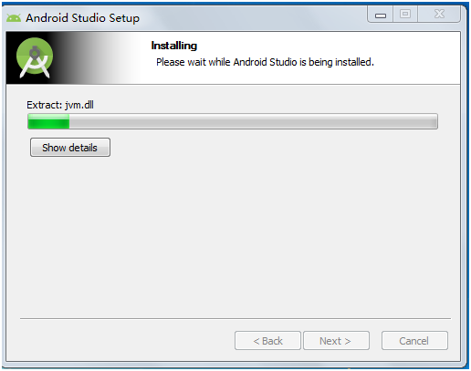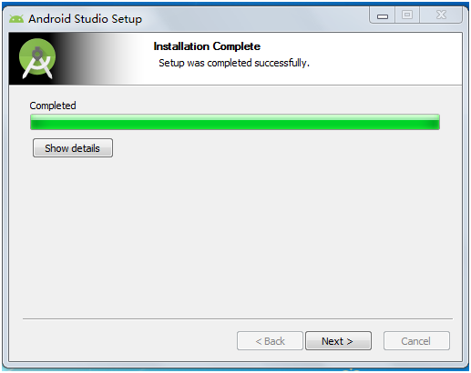

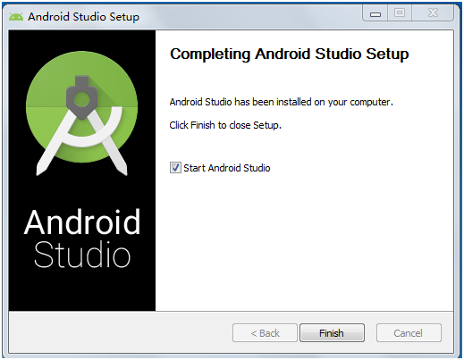

这里Android studio程序安装完毕。

**当然，也可以使用解压版，这个比较省事。**

进入Androidstudio 的bin目录启动AS，

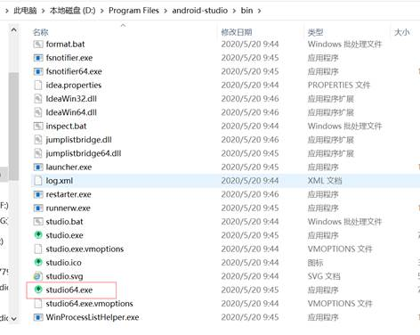

出现下图

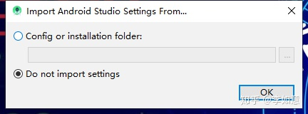

选择第二项，然后点击ok，出现下面的启动界面

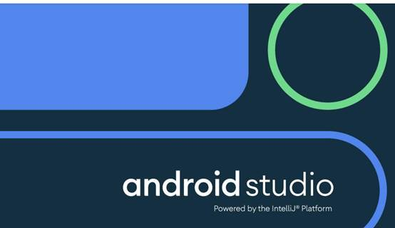

在启动的时候会弹出下图

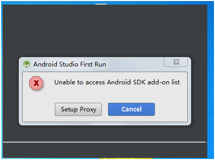

点击cancel，然后进入到了AS的安装向导界面

[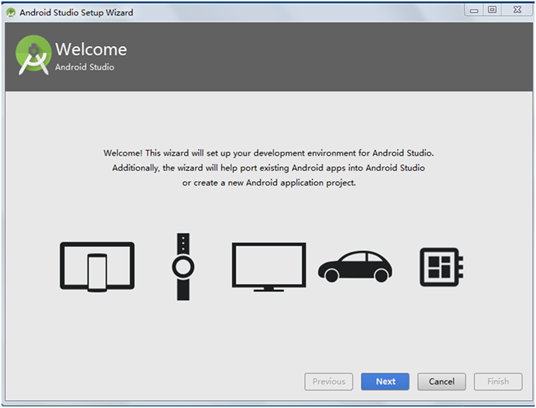](http://files.jb51.net/file_images/article/201711/2017111310000014.png)

点击next进入UI界面主题选择界面，可以选择自己喜欢的风格，这里选择Darcula风格

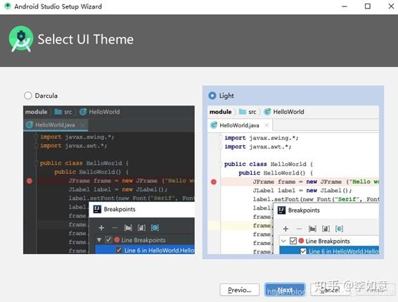

点击下一步，这里需要指定SDK的本地路径，如果之前电脑中已经存在SDK，可以指定该路径，后续就可以不用下载SDK；我这里演示本地没有安装过SDK的场景，这里暂时可以指定一个后续将保存SDK的路径；

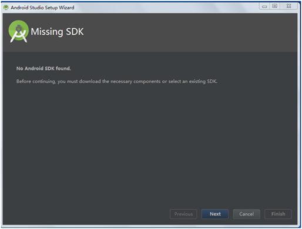

点击Finish后，开始自动下载SDK（注意，此时需要保证电脑联网）

[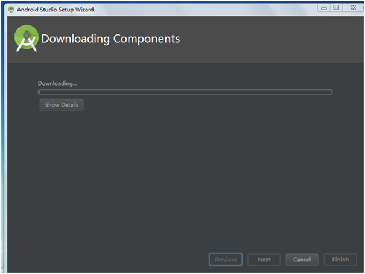](http://files.jb51.net/file_images/article/201711/2017111310000019.png)

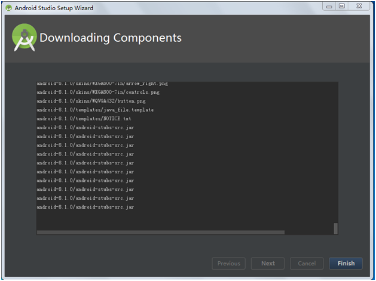

下载完成SDK后，点击Finish进入AS的欢迎界面

 

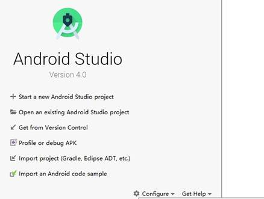

3、配置AS第一次运行环境，并且能成功编译运行一个APP。

点击上图中的Start a new Android Studio project新建一个工程，进入下面的界面

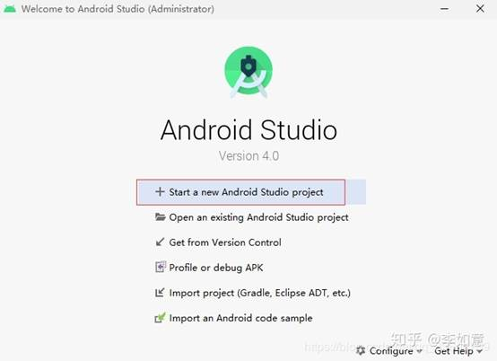

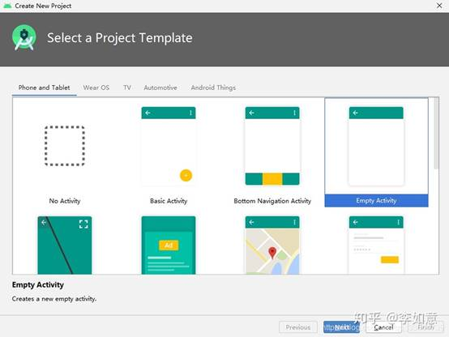

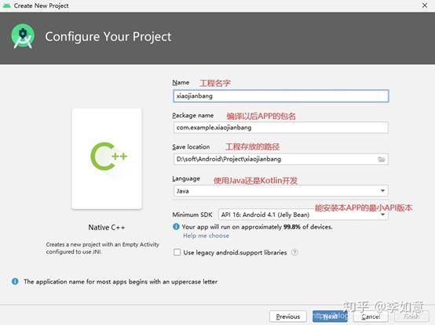

 

 

 

到此，一个工程建立完成，第一次建立的工程会发现卡在下面的启动界面

 

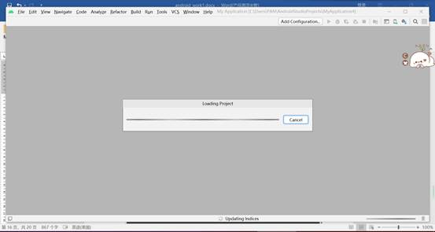

第一次建立工程卡在该界面的时候，是因为在从网上下载gradle构建工具，耐心等待（需要网络环境良好）；

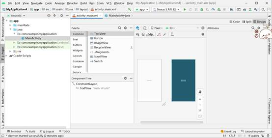

AndroidStudio项目创建和配置成功。

4.下面，我们生成APK文件

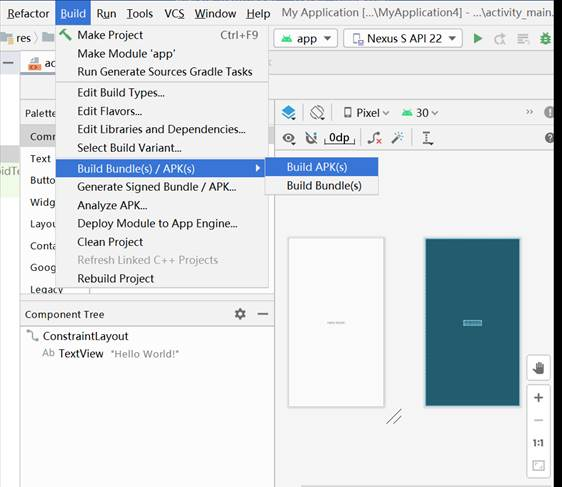

 

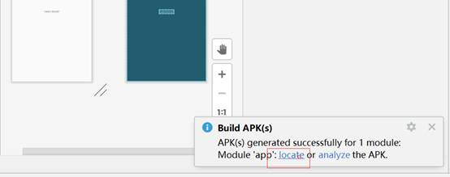

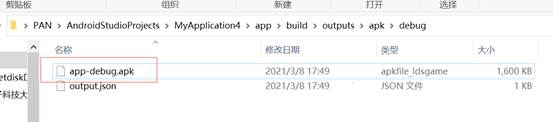

生成apk文件之后，导出该apk文件到模拟器或者真机上面进行安装，运行效果图如下

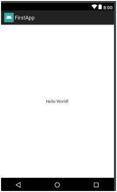

至此，Android Studio的安装以及开发环境就配置好了。

5.配置原生模拟器

（1）进入BIOS开启VT技术

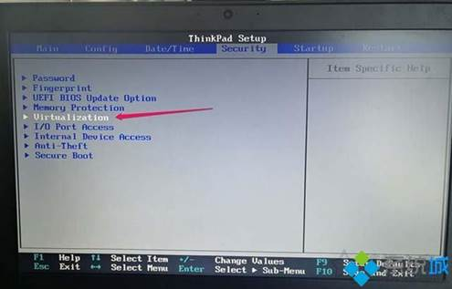

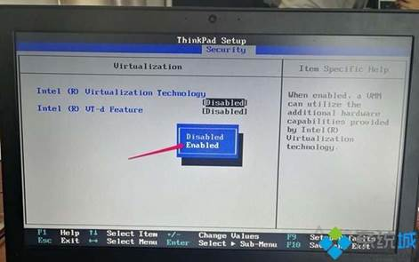

 

 电脑型号不一，开启方法可自行百度

（2）设置禁止驱动程序强制签名

 

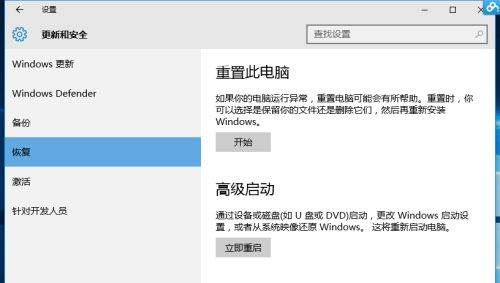

 

 

（3）打开项目创建虚拟设备

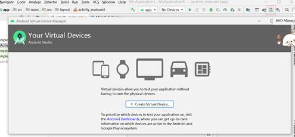

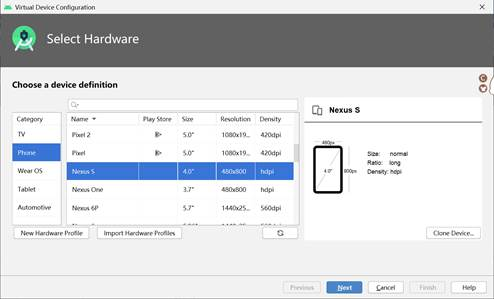

 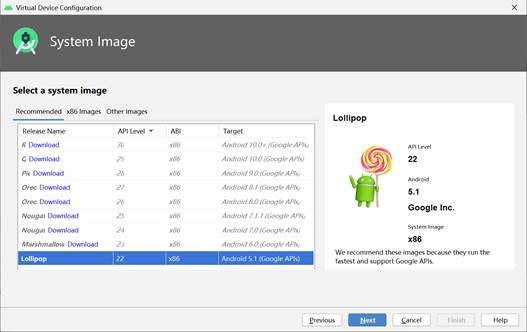

如提示安装HAXM，那就默认安装。

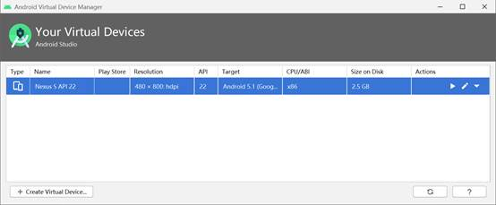

启动后出现手机模拟器

 

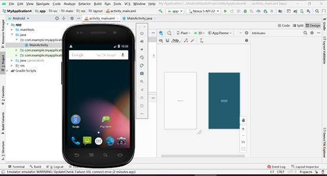

建项目发布到模拟器上

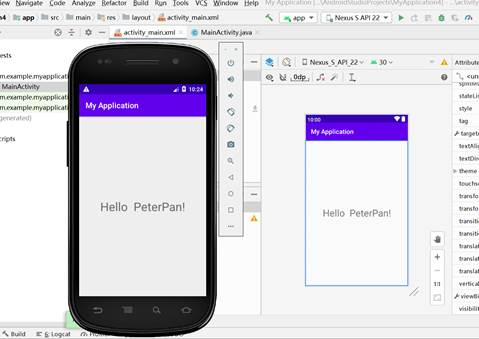

6.其他模拟器配置

原生模拟器比较繁琐，还有不少兼容错误，如配置不出来可选其他模拟器

（1）   雷电、夜神、蓝叠、海马玩

（2）   genimotion（专业模拟器）