**实验10 UI（9）**

 

**一、准备知识**

**1.spinner**

Spinner是Android里一个类似web中下拉菜单的UI控件。Spinner的继承结构比较复杂，在继承树中有AdapterView，这是比较重要的一项，因为我们就是通过Adapter来为Spinner设置下拉列表项的。 
   Spinner的重点问题就是下拉列表项的配置，通过之前组件的了解，我们知道资源组件的配置有两种方式，一种是通过XML文件来配置，一种是通过程序来配置。而从Spinner的文档中，我们可以看到，对它的配置需要使用Adapter类的实现。

**2.Adater**

Adapter在Android应用程序中起着非常重要的作用，应用也非常广泛，它可看作是数据源和UI组件之间的桥梁。

自定义Adapter子类，就需要实现getcount（）、getitem（）等几个方法，其中最重要的是getView()方法，它是将获取数据后的View组件返回，如ListView中每一行里的TextView、Gallery中的每个ImageView。

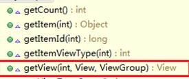

 

BaseAdapter就Android应用程序中经常用到的基础数据适配器，它的主要用途是将一组数据传到像ListView、Spinner、Gallery及GridView等UI显示组件，它是继承自接口类Adapter。

BaseAdapter是实现了ListAdapter和SpinnerAdapter两个接口，当然它也可以直接给ListView和Spinner等UI组件直接提供数据。

**二、作业** 

1、 创建3个窗口：MainActivity、SP1Activity和SP2Activity。

去掉默认textview，为MainActivity加入一个spinner和button。

spinner的id设为spm，button的id为btok。

为string.xml添加字段

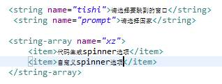

然后修改spinner的若干属性为：

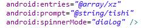

以上是静态地为spinner添加选项的方式。

为MainActivity.java添加代码，使得在选择了spinner选项后，点击按钮可以跳转：

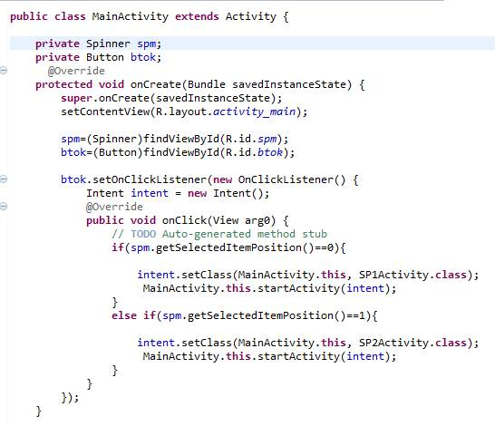

2、实现动态添加spinner选项

去掉默认textview，为SP1Activity加入一个spinner，id为sp1。

在layout文件夹下，新建一个布局文件txtlayout.xml，用于修改spinner的item选项字体样式

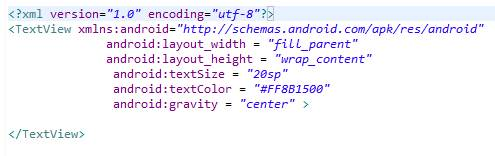

为SP1Activity.java添加代码：

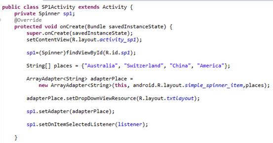

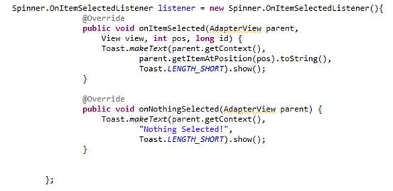

 

 

 

3、实现自定义spinner选项

为SP2Activity加入一个spinner，id为sp2。

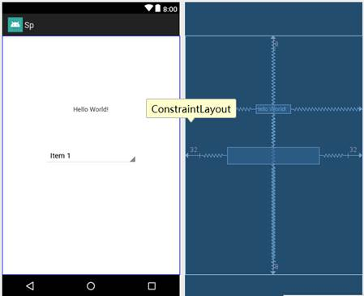

将4张素材图片放到资源文件drawable文件夹下

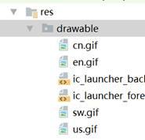

在layout文件夹中创建菜单项的自定义布局文件list.xml

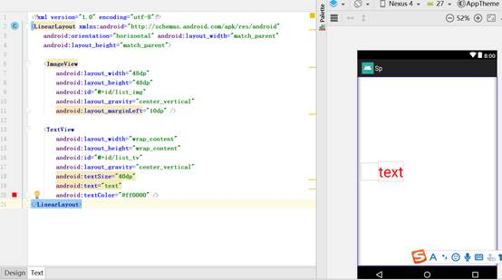

新建一个数据模型类Member.java

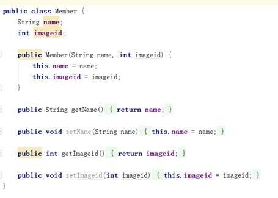

新建一个适配器子类MemberAdapter.java

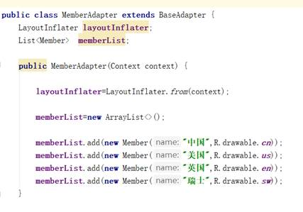

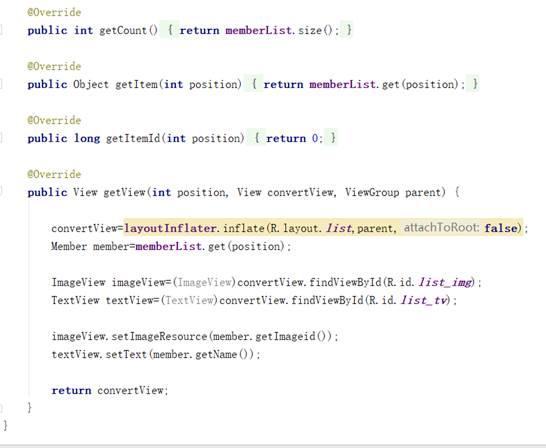

为SP2MActivity.java添加代码：

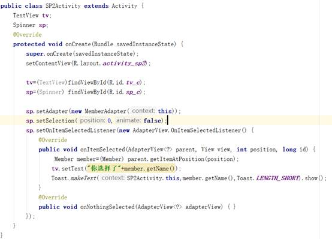

 

 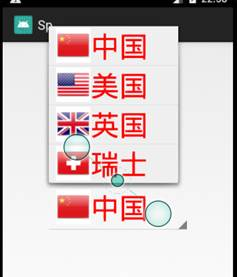 