**实验11 UI（11）**

 

**一、**  **准备知识**

 

**View****和ViewGroup**

Android的UI界面都是由View和ViewGroup及其派生类组合而成的。其中，View是所有UI组件的基类，而ViewGroup是容纳这些组件的容器，其本身也是从View派生出来的。AndroidUI界面的一般结构可参见下面的示意图：
 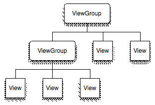
 
   可见，作为容器的ViewGroup可以包含作为叶子节点的View，也可以包含作为更低层次的子ViewGroup，而子ViewGroup又可以包含下一层的叶子节点的View和ViewGroup。事实上，这种灵活的View层次结构可以形成非常复杂的UI布局，开发者可据此设计、开发非常精致的UI界面。
  

　　View派生出的直接子类有：AnalogClock,ImageView,KeyboardView, ProgressBar,SurfaceView, TextView,ViewGroup,ViewStub

　　View派生出的间接子类有：AbsListView,AbsSeekBar, AbsSpinner, AbsoluteLayout, AdapterView,AdapterViewAnimator, AdapterViewFlipper, AppWidgetHostView, AutoCompleteTextView,Button,CalendarView, CheckBox, CheckedTextView, Chronometer, CompoundButton,

　　ViewGroup派生出的直接子类有：AbsoluteLayout,AdapterView,FragmentBreadCrumbs,FrameLayout, LinearLayout,RelativeLayout,SlidingDrawer

　　ViewGroup派生出的间接子类有：AbsListView,AbsSpinner, AdapterViewAnimator, AdapterViewFlipper, AppWidgetHostView, CalendarView, DatePicker, DialerFilter, ExpandableListView, Gallery, GestureOverlayView,GridView,HorizontalScrollView, ImageSwitcher,ListView,

　　V**iew****和ViewGroup最重要的几个方法——**

　　protected void onDraw(Canvas canvas)：View类中用于重绘的方法，这个方法是所有View、ViewGroup及其派生类都具有的方法，也是Android UI绘制最重要的方法。开发者可重载该方法，并在重载的方法内部基于参数canvas绘制自己的各种图形、图像效果。

　　protected void onLayout(boolean changed, int left, int top, int right, int bottom)：View类中布局发生改变时会调用的方法，这个方法是所有View、ViewGroup及其派生类都具有的方法，重载该类可以在布局发生改变时作定制处理，这在实现一些特效时非常有用。

　　protected void dispatchDraw(Canvas canvas)：ViewGroup类及其派生类具有的方法，这个方法主要用于控制子View的绘制分发，重载该方法可改变子View的绘制，进而实现一些复杂的视效，典型的例子可参见Launcher模块Workspace的dispatchDraw重载。

　　protected boolean drawChild(Canvas canvas, View child, long drawingTime))：ViewGroup类及其派生类具有的方法，这个方法直接控制绘制某局具体的子view，重载该方法可控制具体某个具体子View。

　　addView方法这个方法是用来想View容器中添加组件用的。我们可以使用这个方法想这个ViewGroup中添加组件。

　　getChildAt方法 这个方法用来返回指定位置的View。

　　注意：ViewGroup中的View是从0开始计数的。

　　View在屏幕上显示出来要先经过measure(计算)和layout(布局).

　　onMeasure(int, int) View会调用此方法，来确认自己及所有子对象的大小

　　onLayout(boolean, int, int, int, int, int, int) 当View要为所有子对象分配大小和位置时，调用此方法

　　onSizeChanged(int, int, int, int) 当View大小改变时，调用此方法

 

本次作业用到的控件GridView是ViewGroup派生出的间接子类。

 

GridView

GridView组件用来以网格方式排列视图，与矩阵类似，当屏幕上有很多元素（文字、图片或其他元素）需要显示时，可以使用该组件。

GridView详解https://www.jianshu.com/p/cbdf08841ed4

 

ImageSwticher

ImageSwitcher 组件的主要功能是完成图片的切换显示，例如用户在进行图片浏览时，可以通过单击按钮逐张切换显示的图片，在进行切换时还可以加入一些动画效果。

1. 如果想进行实现图片的切换功能，则定义的 Activity 类还必须实现 ViewSwitcher.ViewFactory 接口，以指定切换视图的操作工厂。
2. 不设置 setFactory() 方法会出现 NullPointerException 错误。
3. 设置动画的方法：setInAnimation(AnimationUtils.loadAnimation(this,     android.R.anim.fade_in))；

 

**RecycleView**

RecyclerView是Android一个更强大的控件,其不仅可以实现和ListView同样的效果,还有优化了ListView中的各种不足。其可以实现数据·纵向滚动,也可以实现横向滚动(ListView做不到横向滚动)。实现瀑布流的布局，更加高级并且更加灵活，提供更为高效的回收复用机制，同时实现管理与视图的解耦合。

RecyclerView详解 https://www.jianshu.com/p/b4bb52cdbeb7

 

**CardView**

- CardView是API21（Android5.0）发布的卡片式控件。简单的说就是卡片视图，扁平化视图。
- 继承自FrameLayout

- CardView可以作为根布局使用，也可以作为ReCycleView或者ListView 的item
- 最常用的属性：

app:cardBackgroundColor这是设置背景颜色
 app:cardCornerRadius这是设置圆角大小

CardView详解 https://www.jianshu.com/p/63751afe368b

 

**WebView**

WebView是android中一个非常重要的控件，它的作用是用来展示一个web页面。它使用的内核是webkit引擎，4.4版本之后，直接使用Chrome作为内置网页浏览器。

WebView详解：https://www.jianshu.com/p/3e0136c9e748

 

**二、作业** 

1、 创建3个窗口：MainActivity、GDActivity、RCVActivity和WBVActivity，为MainActivity的添加radiobutton和button，在button的onclick事件添加代码，使得用户在选择radiobutton时，能够跳转到下一个目标窗口。（图略）

2、实现GridView和ImageSwitcher联合使用

（1）导入照片素材

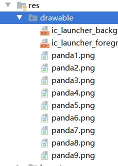

（2）拖入一个ImageSwitcher控件和一个GridView控件，并摆好布局，分别修改好id为imsw和gdv。修改gdv属性：

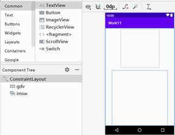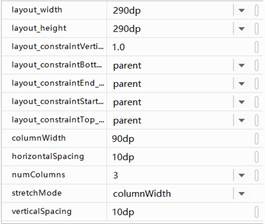

imsw的属性只修改合适的大小即可。

（3）新建一个图片控件的布局文件gdv_item.xml：

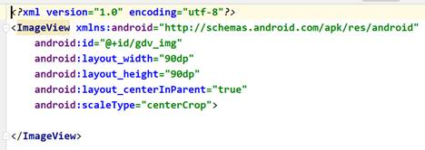

 

（4）为GDMActivity.java添加代码：

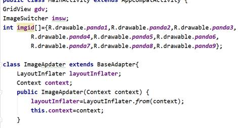

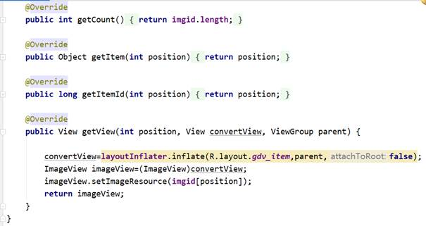

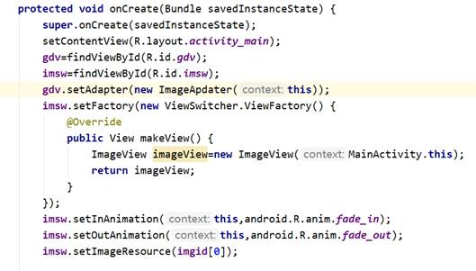

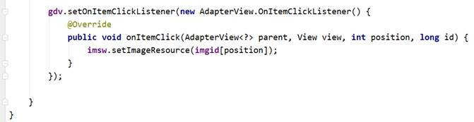

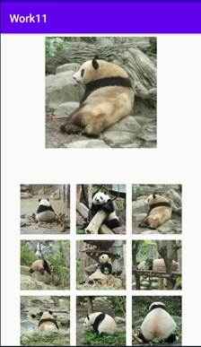

3、实现RecycleView和CardView联合使用

（1）导入照片素材，图片自选，我这用4个国家的。

（2）点击控件栏，下载RecycleView和CardView组件

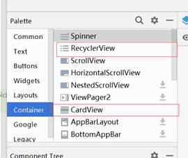

（3）在设计页面拖入一个RecycleView控件和一个TextView控件，并摆好布局，分别修改好id为rcv和tv_name。

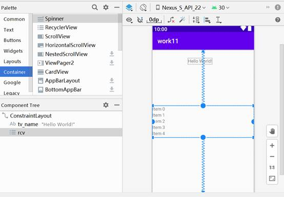

（3）创建一个rcv_cv_item.xml,放到res/layout/目录下，作为rcv的item布局文件

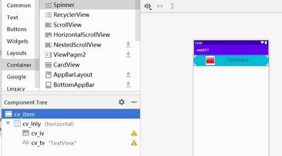

其中cv_item是一个CardView控件，将它的2个属性设置为：

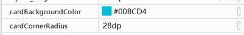

cv_lnly是一个水平的线性布局，里面嵌套的控件和实验10一样。

（4）新建一个数据模型类Member.java，参考实验10。

（5）为RCVActivity.java添加代码：

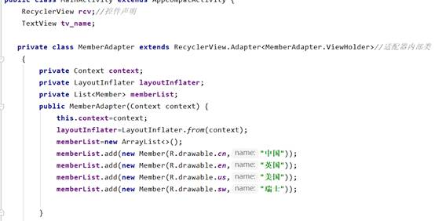

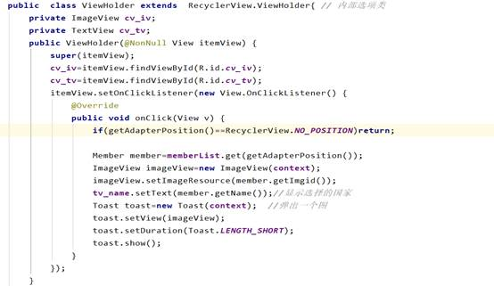

 

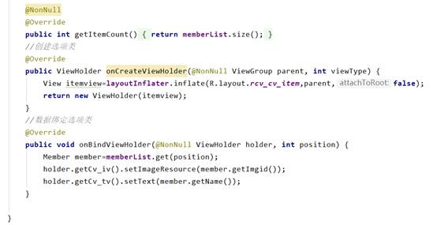

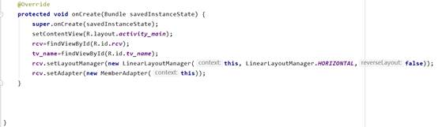

运行效果：

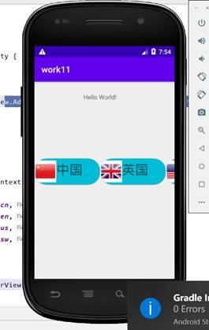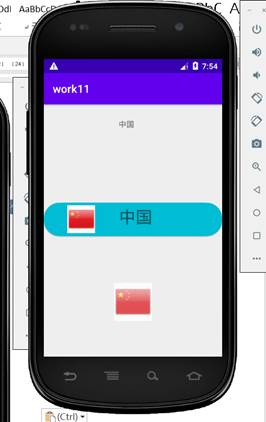

4、实现WebView访问互联网

（1）在清单文件中声明访问网络权限

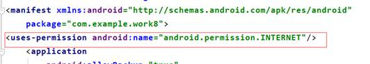

（2）设计界面如下，主要包括两个按钮、一个输入框以及一个WebView。

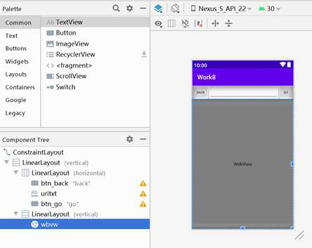

（3）在Activity中编写代码。

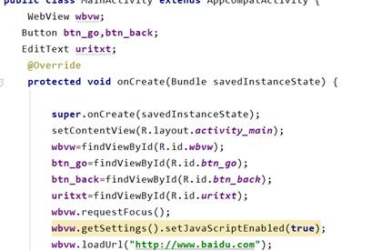

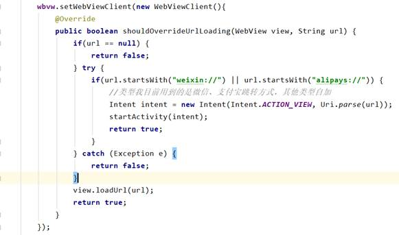

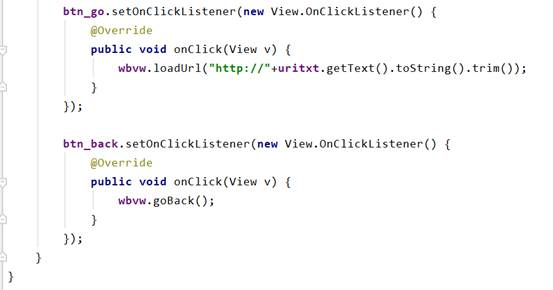

PS：经查实，在Android5.1的模拟器运行WebView存在Bug，所以需要修改gradle文件中appcompat版本，降为1.0.2.

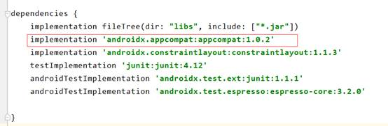

运行效果：

 

 