 **实验14 服务**

 

**一、**  **准备知识**

服务

Service翻译成中文是服务，熟悉Windows 系统的同学一定知道很熟悉了。Android里的Service跟Windows里的Service功能差不多，就是一个不可见的进程在后台执行，避免被用户误关闭。因为Android在某些情况下会自动关闭非前台显示的Activity,所以如果要让一个功能在后台一直执行，不被Android系统关闭，比如说闹钟、后台播放音乐，就必须使用Service.

Service的生命周期Service的生命周期方法比Activity少一些，只有onCreate,onStart,onDestroy
 　我们有两种方式启动一个Service,他们对Service生命周期的影响是不一样的。
 　1通过startService
 　Service会经历onCreate->onStart
 　stopService的时候直接onDestroy
 　
 　如果是调用者(TestServiceHolder)自己直接退出而没有调用stopService的
 　话，Service会一直在后台运行。
 　下次TestServiceHolder再起来可以stopService。
 　
 　2通过bindService
 　Service只会运行onCreate，这个时候TestServiceHolder和TestService绑定在一起
 　
 　TestServiceHolder退出了，Srevice就会调用onUnbind->onDestroyed
 　所谓绑定在一起就共存亡了。

 

服务不能自己运行，需要通过调用Context.startService()或Context.bindService()方法启动服务。这两个方法都可以启动Service，但是它们的使用场合有所不同。使用startService()方法启用服务，调用者与服务之间没有关连，即使调用者退出了，服务仍然运行。使用bindService()方法启用服务，调用者与服务绑定在了一起，调用者一旦退出，服务也就终止，大有“不求同时生，必须同时死”的特点。

如果打算采用Context.startService()方法启动服务，在服务未被创建时，系统会先调用服务的onCreate()方法，接着调用onStart()方法。如果调用startService()方法前服务已经被创建，多次调用startService()方法并不会导致多次创建服务，但会导致多次调用onStart()方法。采用startService()方法启动的服务，只能调用Context.stopService()方法结束服务，服务结束时会调用onDestroy()方法。
 　
 　如果打算采用Context.bindService()方法启动服务，在服务未被创建时，系统会先调用服务的onCreate()方法，接着调用onBind()方法。这个时候调用者和服务绑定在一起，调用者退出了，系统就会先调用服务的onUnbind()方法，接着调用onDestroy()方法。如果调用bindService()方法前服务已经被绑定，多次调用bindService()方法并不会导致多次创建服务及绑定(也就是说onCreate()和onBind()方法并不会被多次调用)。如果调用者希望与正在绑定的服务解除绑定，可以调用unbindService()方法，调用该方法也会导致系统调用服务的onUnbind()-->onDestroy()方法.

**二、作业** 

完成一个基于Service组件的音乐播放器，程序的音乐将会由后台的Service组件负责播放，当后台的播放状态改变时，程序将会通过发送广播通知前台Activity更新界面；当用户单击前台Activity的界面按钮或拖动进度条时，系统通过发送广播通知后台Service来改变播放状态和播放指定音乐。

1、 创建1个窗口：MainActivity，并将UI界面设计为如下。

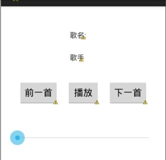

 

2、（1）将几首歌曲（最好是mp3或者m4a文件）放进assets文件夹(右键app模块-new-folder-assetes，还有由于默认环境不支持中文，所以请将歌曲重命名为英文)。

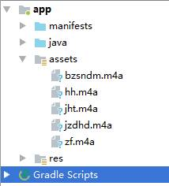

（2）创建一个空菜单，名字叫menu_main.xml

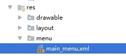

3、新建一个service类MusicService，为MusicService.java添加代码：

（1）创建接收器过滤常量和信号常量。

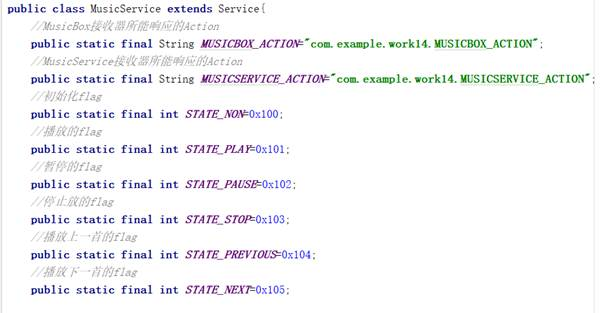

（2）其他变量

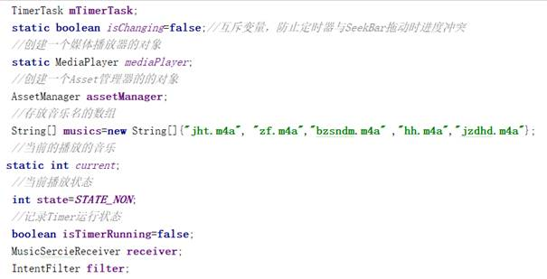

（3）初始化

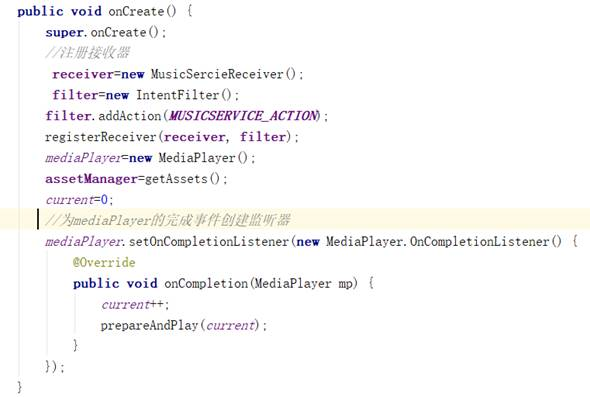

（4）装载和播放音乐的方法

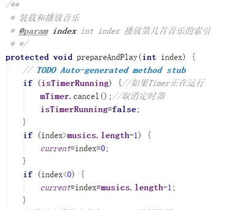

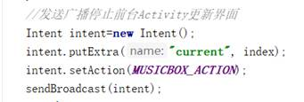

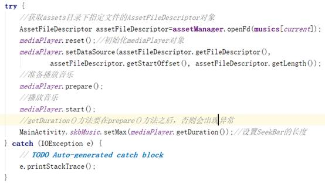

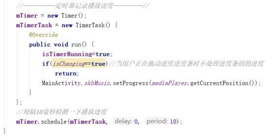

（4）接收器

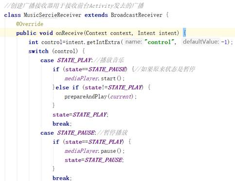

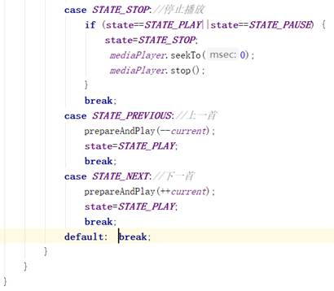

4、在[Android](http://www.2cto.com/kf/yidong/Android/)Manifest.xml中注册Service

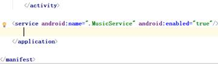

5、为MainActivity.java添加代码：

（1）创建接收器过滤常量和信号常量。

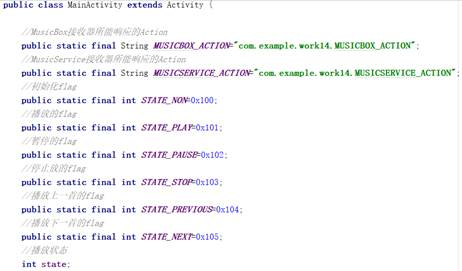

（2）其他变量

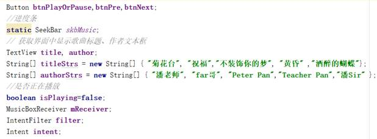

（3）初始化

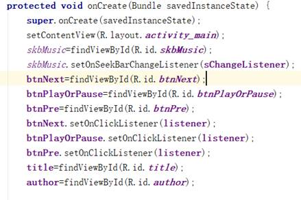

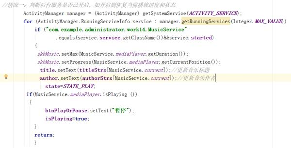

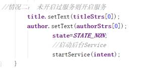

（4）按钮监听器

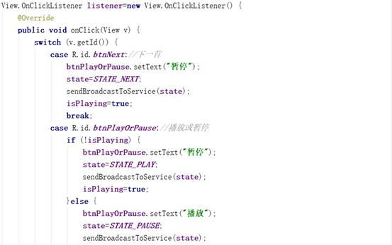

（5）进度条监听

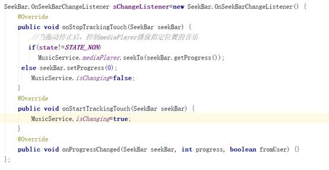

（6）接收器实现、发送广播、菜单停止和退出

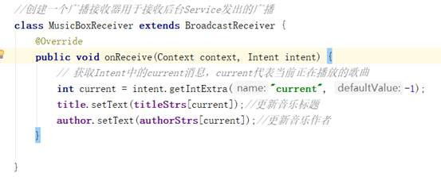

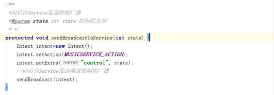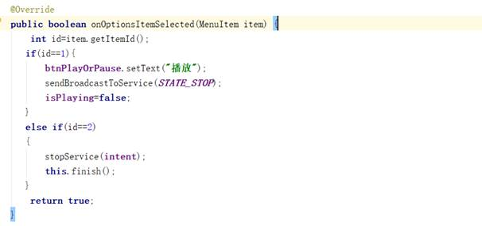

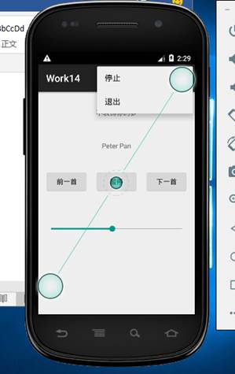