**实验16 数据库SQLite**

 

**一、准备知识**

SQLite是一种轻量级的小型数据库，虽然比较小，但是功能相对比较完善，一些常见的数据库基本功能也具有，在现在的嵌入式系统中使用该数据库的比较多，因为它占用系统资源很少。Android系统中也不例外，也是采用SQLite。

**数据库基础概念**

SQlite 通过文件来保存数据库，一个文件就是一个数据库。

数据库里又包含数个表格；

每个表格里面包含了多个记录；

每个记录由多个字段组成；

每个字段都有其对应的值；

每个值都可以指定类型。

数据库名称即文件名；表格有自己的名称；记录没有名称；每个字段都有名称。在SQlite中，记录没有顺序的概念，不存在第一、第二此类的概念；只能通过查询来获取满足条件的记录。我们通过执行SQL指令来操作数据库。

**Android****平台下数据库相关类**

SQLiteOpenHelper 抽象类：通过从此类继承实现用户类，来提供数据库打开、关闭等操作函数。

SQLiteDatabase 数据库访问类：执行对数据库的插入记录、查询记录等操作。

SQLiteCursor 查询结构操作类：用来访问查询结果中的记录。

 

**创建数据库**

假设使用一个数据库存储一个表格，表格中保存了多条记录，每个记录包含3个字段，分别是： ID、name、age。 从SQLiteOpenHelper继承实现一个类，所有对数据库的操作都封装在此类中，包括添加、更新和删除。

 

更多SQLite知识可参考：

http://blog.csdn.net/liuhaomatou/article/details/23797107

**二、作业** 

1、 创建4个窗口：MainActivity、ADDActivity、QRYActivity和MNGActivity。为MainActivity的添加radiobutton和button，在button的onclick事件添加代码，使得用户在选择radiobutton时，能够跳转到下一个目标窗口。

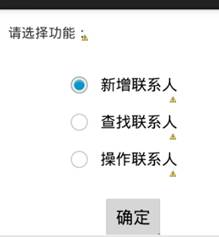

2、基于MVC思想，我们先创建和编写好数据模型Site.java。

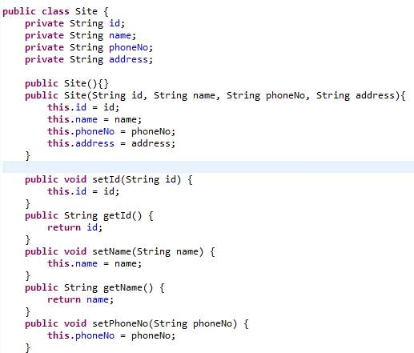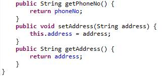

3、创建和编写好数据库操作类SitesDBHlp.java。

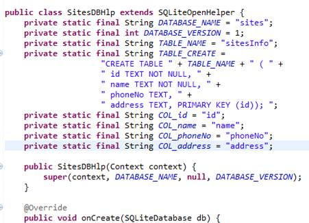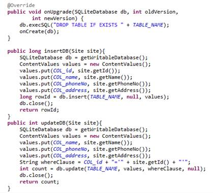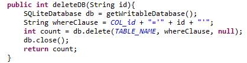

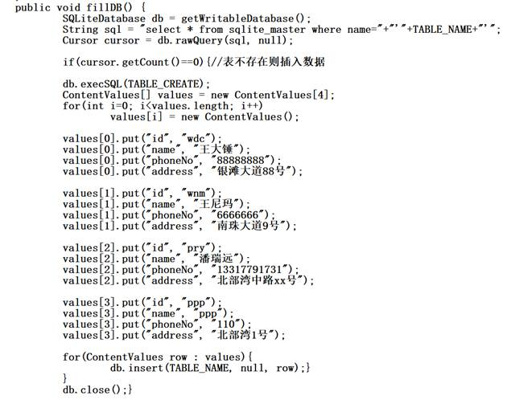

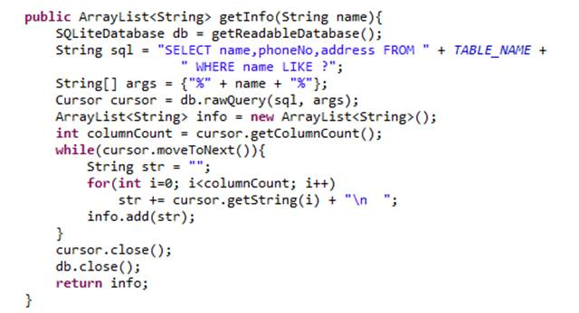

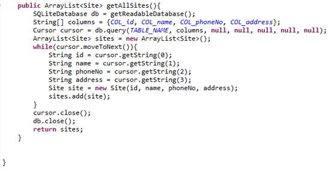

3、实现数据初始化，为MainActivity.java的onCreate方法添加代码：

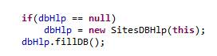

 

4、实现新增记录。

（1）编辑ADDActivity窗口，将界面设计如下。

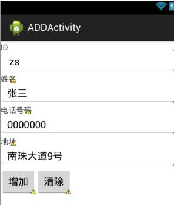

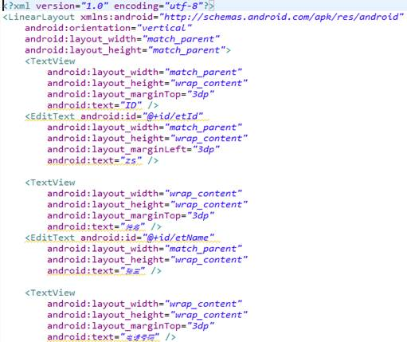

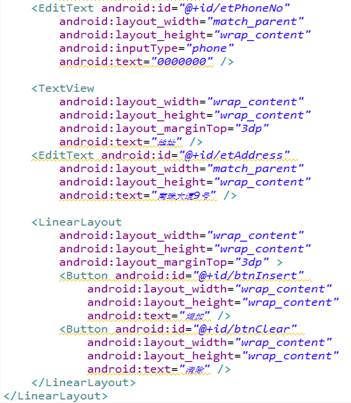

 

 

(2)为ADDActivity.java添加代码：

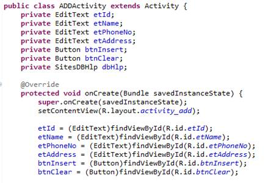

 

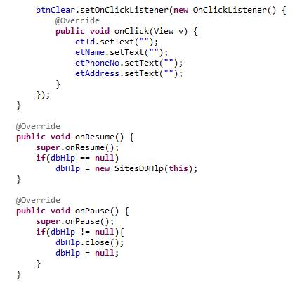

5、实现查找记录。

（1）编辑QRYActivity窗口，将界面设计如下。

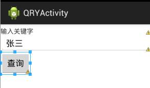

 

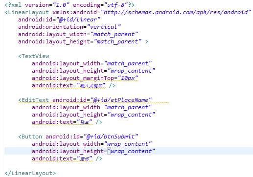

(2)为QRYActivity.java添加代码：

6、实现操作记录。

（1）编辑MNGActivity窗口，将界面设计如下。

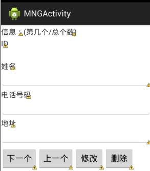

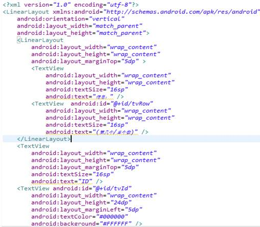

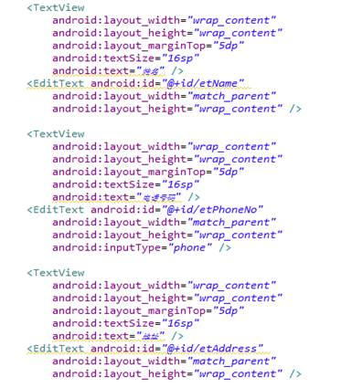

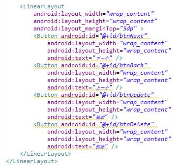

(2)为MNGActivity.java添加代码：

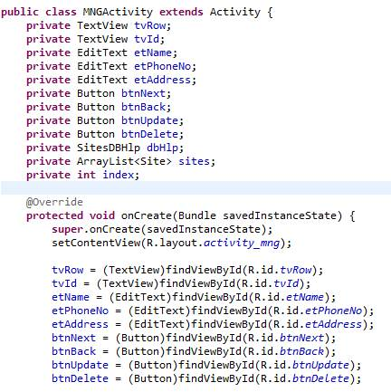

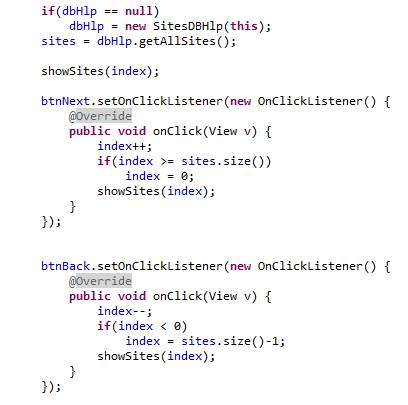

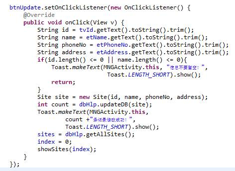

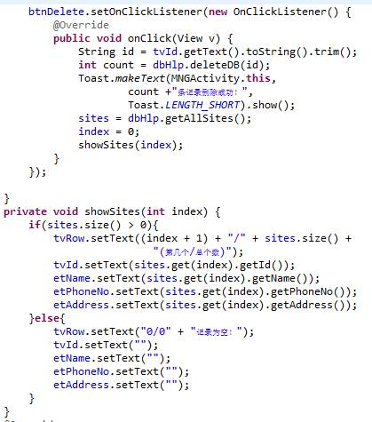

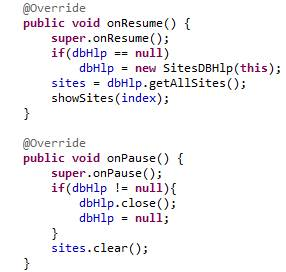

 

 

 