**第十七次课 片段Fragment**

 

**一、**  **准备知识**

**1、** **Fragment**

[**Android**](http://lib.csdn.net/base/android)运行在各种各样的设备中，有小屏幕的手机，超大屏的平板甚至电视。针对屏幕尺寸的差距，很多情况下，都是先针对手机开发一套App，然后拷贝一份，修改布局以适应平板神马超级大屏的。难道无法做到一个App可以同时适应手机和平板么，当然了，必须有啊。Fragment的出现就是为了解决这样的问题。你可以把Fragment当成Activity的一个界面的一个组成部分，甚至Activity的界面可以完全有不同的Fragment组成，更帅气的是Fragment拥有自己的生命周期和接收、处理用户的事件，这样就不必在Activity写一堆控件的事件处理的代码了。更为重要的是，你可以动态的添加、替换和移除某个Fragment。

**2****、Fragment的生命周期**

Fragment必须是依存与Activity而存在的，因此Activity的生命周期会直接影响到Fragment的生命周期。官网这张图很好的说明了两者生命周期的关系：

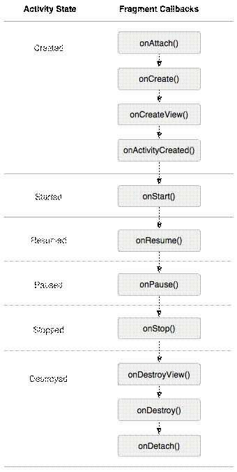

可以看到Fragment比Activity多了几个额外的生命周期回调方法：
 **onAttach(Activity)**
 当Fragment与Activity发生关联时调用。
 **onCreateView(LayoutInflater, ViewGroup,Bundle)**
 创建该Fragment的视图
 **onActivityCreated(Bundle)**
 当Activity的onCreate方法返回时调用
 **onDestoryView()**
 与onCreateView想对应，当该Fragment的视图被移除时调用
 **onDetach()**
 与onAttach相对应，当Fragment与Activity关联被取消时调用
 注意：除了onCreateView，其他的所有方法如果你重写了，必须调用父类对于该方法的实现.

 

Android是在Android 3.0 (API level 11)开始引入Fragment的。

可以把Fragment想成Activity中的模块，这个模块有自己的布局，有自己的生命周期，单独处理自己的输入，在Activity运行的时候可以加载或者移除Fragment模块。

可以把Fragment设计成可以在多个Activity中复用的模块。当开发的应用程序同时适用于平板电脑和手机时，可以利用Fragment实现灵活的布局，改善用户体验。

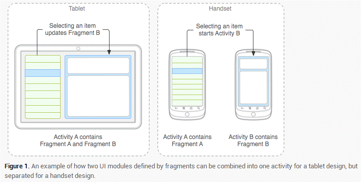

**二、作业** 

完成一个含有两个fragment的Activity的画面拆分。当横屏时，显示两个fragment在一个Activity，当竖屏时，分别显示两个fragment在两个Activity。

1、基于MVC的思想，我们新建一个国家类，用于,数据模型存储。

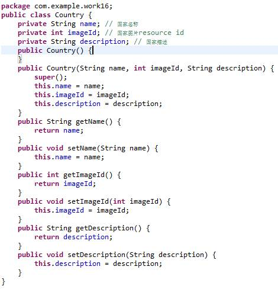

2、将图片素材导入资源文件。

3、新建一个帮助类，用于国家数据实例初始化。

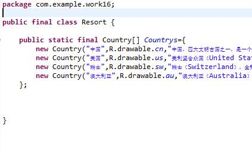

4、创建res/layout/detail_fragment.xml,用于显示国旗和国家描述。

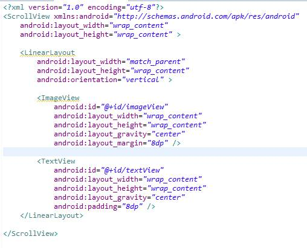

5、新建一个细节片段类DetailFragment.java。

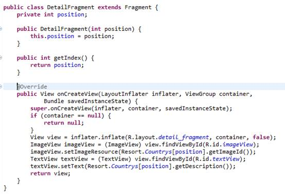

修改：为修正横屏变回竖屏时出现报错的bug，请在此段代码的构造方法处多添加一个无参构造方法: public DetailFragment（）{}

6、新建DetailActivity窗口，用于竖屏的选中的一个国家细节信息，代码如下。

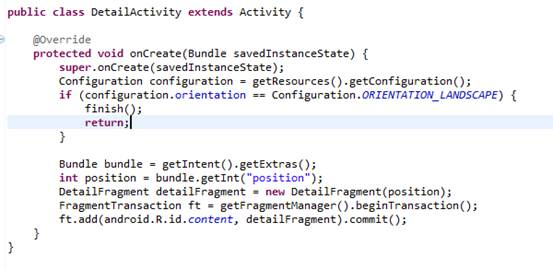

 

 

7、新建一个主片段类MasterFragment.java。

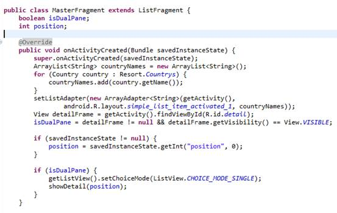

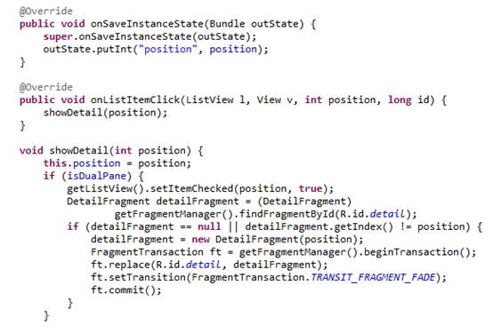

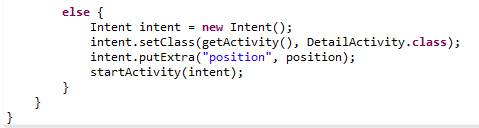

 

6、 将res/layout/activity_main.xml修改为竖屏模式，代码如下。

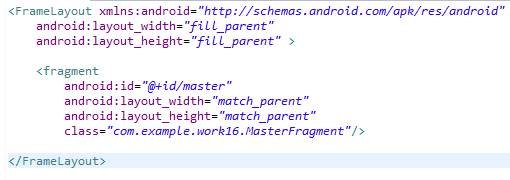

7、新建res/layout-land/activity_main.xml，作为横屏模式，代码如下。

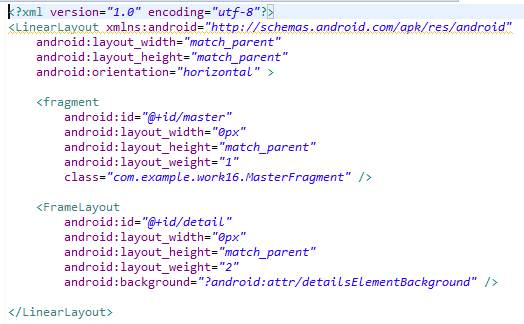

竖屏

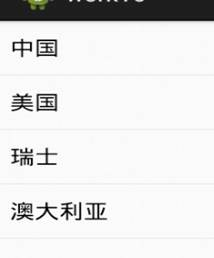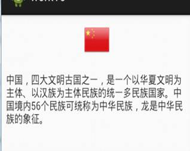

横屏（crtl+F11切换）

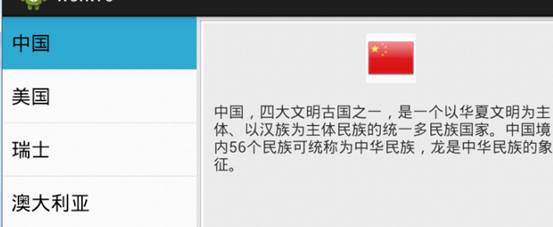

 