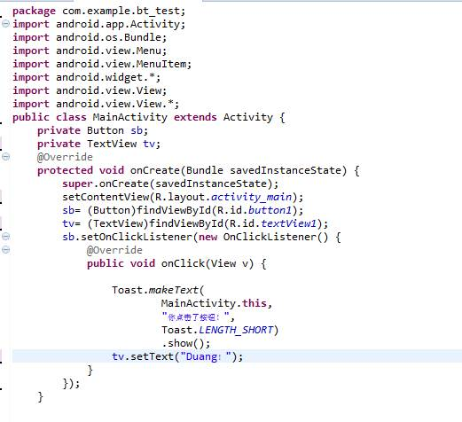

**实验2 UI（1）**

 

**一、准备知识**

\1. **Android****项目工作区概览**


　　新建一个Android项目，系统会自动帮我们建立诸多文件，我们看一下：
 　（1）manifests

每一个Android项目都包含一个清单文件--AndroidManifest.xml，它存储在项目层次中的最底层。清单可以定义应用程序及其组件的结构和元数据。　

（2）java
 　存放所有的java源程序和测试用的java源程序。

（3）res：可以存放项目中所有的资源文件，如图片（*.png、*.jpg）、网页（*.html）、文本等。

drawable 保存图片资源。
 　layout：存放所有布局文件，主要是用于排列不同的显示组件，在Android程序要读取此配置。

mipmap：存放位图，图标文件
 　values：存放一些资源文件信息，用于读取文本资源，在文件夹中有一些约定的文件名称。（具体内容待以后详解）
 　raw：自定义的一些原生文件所在目录，如音乐、视频等文件格式。
 　其实这个项目文件视图算是简单的了，Android Studio还可以切换更复杂的项目视图比如package、project等。

\2. Android项目分析

*（1）布局文件（res\layout\activity_main.xml）*
 　双击“res\layout\activity_main.xml”打开布局文件。注意①代表布局文件图形界面；②代表布局文件代码界面。

　　　　　　　　　

　　

　　Android App应用程序类似于.net的Winform程序，其中①和②相当于标题栏，①为标题栏的图标，②为标题；③代表标签<TextViw>，类似于众多程序的Label。

　　

　　我们再来看一下代码：

[Text](http://www.genwoxue.com/contents/13/75.html)[Copy to clipboard](http://www.genwoxue.com/contents/13/75.html)[Print](http://www.genwoxue.com/contents/13/75.html)

\1.   

\2.   <RelativeLayout xmlns:android="http://schemas.android.com/apk/res/android" 

\3. 　　xmlns:tools="http://schemas.android.com/tools" 

\4. 　　android:layout_width="match_parent" 

\5. 　　android:layout_height="match_parent" 

\6. 　　tools:context=".MainActivity" > 

\7.   　　<TextView 

\8. 　　android:layout_width="wrap_content" 

\9. 　　android:layout_height="wrap_content" 

10.　　android:layout_centerHorizontal="true" 

11.　　android:layout_centerVertical="true" 

12.　　android:text="@string/hello_world" /> 

13.</RelativeLayout> 

```
 
    <RelativeLayout xmlns:android="http://schemas.android.com/apk/res/android"
　　xmlns:tools="http://schemas.android.com/tools"
　　android:layout_width="match_parent"
　　android:layout_height="match_parent"
　　tools:context=".MainActivity" >
    　　<TextView
　　android:layout_width="wrap_content"
　　android:layout_height="wrap_content"
　　android:layout_centerHorizontal="true"
　　android:layout_centerVertical="true"
　　android:text="@string/hello_world" />
</RelativeLayout>
```

　　希望你在探讨本段代码之前，至少至少要有XML文件的概念，如果没有请了解这后再来继续学习。

　　本段代码包含了两个重要标签：<RelativeLayout>和<TextView>，<RelativeLayout>代表线性布局管理器；<TextView>代表标签组件。其它的皆为两个标签的属性。

　　我们着重来看一下：android:text="@string/hello_world"，我们的运行结果是“Hello world!”而不是“hello_world”!

　　Why?

（2）strings文本资源文件（res\values\strings.xml）

　　双击“res\values\strings.xml”打开文本资源文件。与布局文件一样：①代表文本资源图形界面；②代表文本资源代码界面。

　　

　　

　　

　　我们打开文本资源strings.xml文件之后，当我们看到：

　　　　 <string name="hello_world">Hello world!</string>

　　前面的疑虑应该顿消，原来如此啊！hello_world是文本资源文件中的一个标签而已，其真正的内容是“Hello world!”。

　　你可以通过图形界面或者字符界面添加一个字符串资源，究竟你选择哪种，随你高兴！

（3）、AndroidManifest.xml文件

　　双击“AndroidManifest.xml”项目配置文件。

　　

　　所有的Activity程序都在AndroidManifest.xml文件中进行注册，故该文件是整个Android项目的核心配置文件。

　　在<application>节点中配置的android:icon="@drawable/ic_launcher"，表示引用drawable（drawable-hdpi、drawable-ldpi、drawable-mdpi三个文件夹中导入）资源配置的图标，引入图标的名称为ic_launcher。现在你可以更换应用程序图标了，你知道了它在哪！

　　在<application>节点中配置的android:label="@string/app_name"，表示此应用程序的标签名称从strings.xml文件中读取，内容为app_name对应的内容。现在你也可以更换应用程序标题了，你知道了它在哪！

　　当然，你还可以更改Activity的标题，什么是Activity？

　　Activity就是一个活动的窗体，一个项目应用程序可以包含多个Activity。

（4）MainActivity.java

　　双击“MainActivity.java”程序文件。

　　

　　本程序是Android整个项目的主程序，Activity是项目的基本组成部分。

　　MainActivity继承Activity类，onCreate()方法是启动Activity地默认调用的方法。

　　super.onCreate(savedInstanceState)：调用父类的onCreate()方法；

　　setContentView(R.layout.activity_main)：调用布局文件。

 

 

**二、例子**

 

添加一个Button控件，点击后使Hello world的文字变为“ Duang！”

****

**（1）**设计登录窗口

打开“res/layout/activity_main.xml”文件。
 　从工具栏向activity拖出1个按钮（来自Form Widgets）

切换activity_main.xml代码模式，可看到代码自动生成如下：

****

**（2）**添加单击事件　

　　打开“MainActivity.java”文件。
 　然后输入以下代码：

 ****

**（3）运行程序**　

 

 

**三、作业**

开发一个登录窗口。我们需要学习Android中的基本控件：(1)EditText编辑框（注意一个是text，一个是password类型）、(2)Button按钮。

****

 


 

 

 

 

 

 

 

 

拓展题：

为密码输入框添加一个OnTextChangedListenser监听接口，监听密码框的长度，一旦密码框输入超过6位，显示消息框”密码超过6位！”，并将密码框清空。

