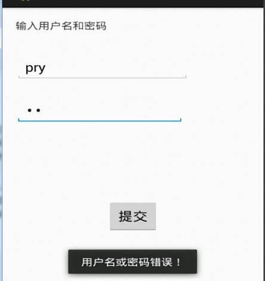
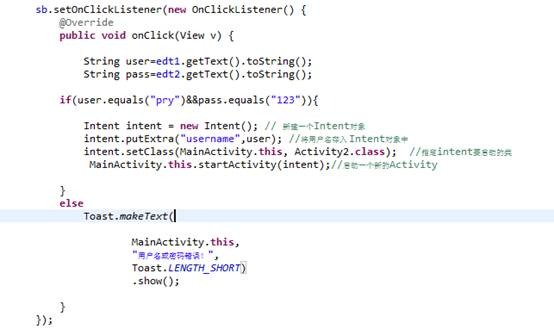
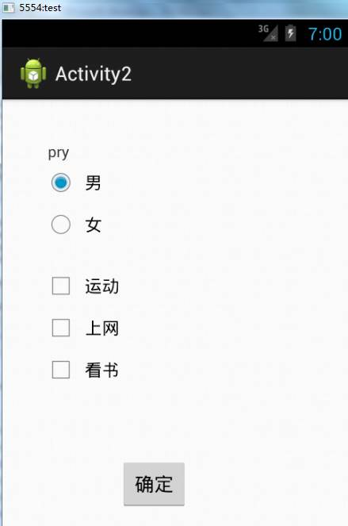
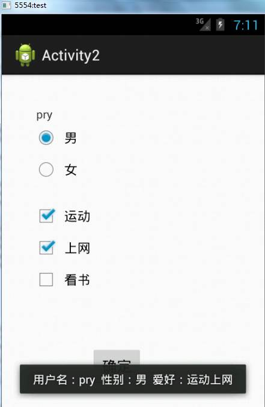
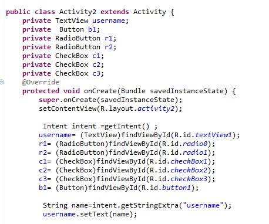
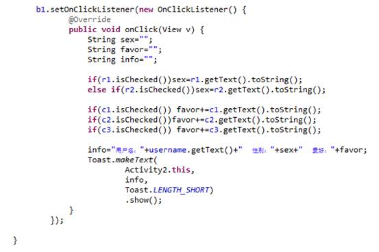

**实验3 UI（2）**

 

**一、准备知识**

\1. 在Android　App应用中，单选按钮和复选框也是经常使用的,但使用中我们要注意，复选框CheckBox我们可以一个一个地拖进activity，而单选按钮RadioButton则不是，它是成组的拖过去的，也就是要拖动的控件是RadioGroup（自动包含3个单选按钮RadioButton）。

 

\2. Android实现不同Active页面间的跳转,可以使用Intent对象。

 

假设在一个窗口Activity1中：

 

Intent intent = new Intent(); // 新建一个Intent对象 

intent.putExtra("Activity1value",value); //将字符值入 Intent对象中  

intent.setClass(Activity1.this, Activity2.class); //指定intent要启动的类

 Activity1.this.startActivity(intent);//启动一个新的Activity 

 

跳转到Activity2时获取传过来的值：   

 

Intent intent =getIntent() ;

String name=intent.getStringExtra("username");  

 

**二、作业**

1、 在上次作业的基础上，为主窗口的提交按钮的onclick事件继续添加代码，为程序设置一组合法用户，例如输入的用户名是“xxx”（你的名字缩写）并且密码是“123”时，能够跳转到写下一个窗口Activity2，并将登陆的用户名传到Activity2。否则显示“用户名或密码错误！”的消息框。

相关代码：

 

2、 再开发一个窗口Activity2，里面有4种控件：TextView，RadioGroup、CheckBox和Button。TextView显示主窗体传过来的用户名，RadioGroup为性别选择，CheckBox为个人爱好选择。

3、 为Button添加监听器，点击后再消息框中显示用户名和所有控件被选中的值。

 

第2和第3步的相关代码:

 

拓展：

为RadioButton添加监听器，一旦某项被选择中，则弹出消息框显示被选中的值。

 