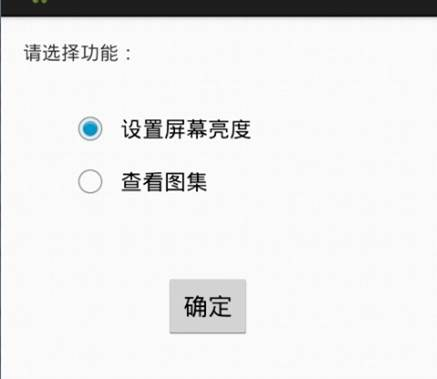
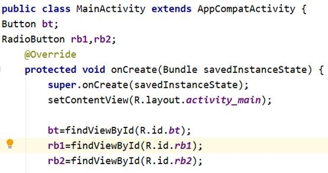
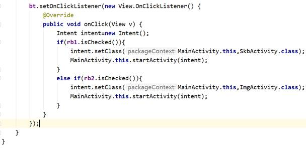
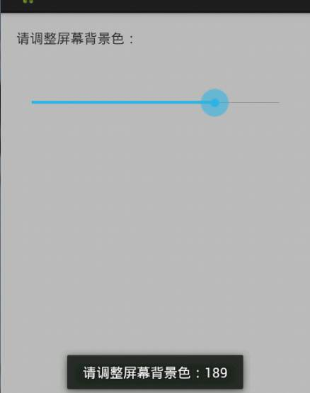
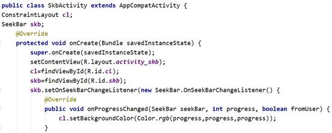
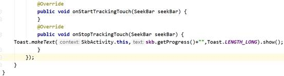
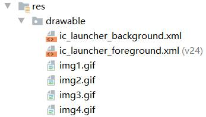
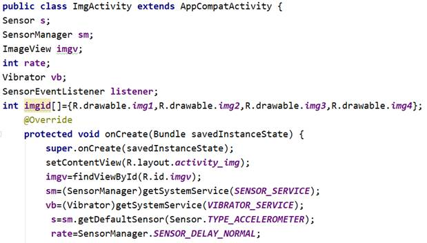
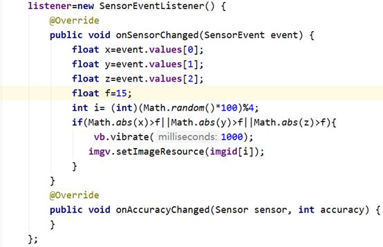
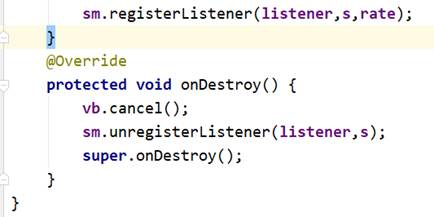

**实验4 UI（3）**

 

**一、准备知识**

 

**1. SeekBar**

 调整屏幕亮度、听歌或者看电影时快进或者退回、调节音量大小，我们都会用到SeekBar拖动条。

（1）拖动条SeekBar的事件

   由于拖动条可以被用户控制。所以需要对其进行事件监听，这就需要实现SeekBar.OnSeekBarChangeListener接口。此接口共需要监听三个事件，分别是：
         数值改变（onProgressChanged）
         开始拖动（onStartTrackingTouch）
         停止拖动（onStopTrackingTouch）

　（2）拖动条的主要属性和方法

​      setMax（）
​       设置拖动条的数值

​      setProgress（）
​       设置拖动条当前的数值

 

**2. ImageView**

在Android　App应用中，图像是必不可少的。呈现一张单幅的图片，我们可以通过图像ImageView来展示。ImageView是通过引用和读取项目res/drawable目录下的图片资源文件来显示的。

 

**二、作业**

1、SeekBar

 (1)创建3个窗口：MainActivity、SkbActivity和ImgActivity，为MainActivity的添加radiobutton和button，在button的onclick事件添加代码，使得用户在选择radiobutton时，能够跳转到下一个目标窗口。

1）从工具栏向activity拖1个radiogroup和两个radiobutton，1个按钮Button。

2)设置Button id为btok

\3) 在MainActivity.java添加代码

(2)编辑SkbActivity窗口，给该窗口添加一个seekbar控件，并为其添加OnSeekBarChangeListener接口，在其响应函数onProgressChanged（）和onStopTrackingTouch中添加相应代码，使其完成一个调整屏幕亮度的功能。

\1) 从工具栏向activity拖1个seekbar

2)设置seekbar的属性：id为skb， max为255,progress为255

3）由于我们默认窗口的布局为约束布局，但未设置id,我们设置其id为cl

4）在SBActivity.java添加代码

注：可以在string.xml声明的一个字符串变量bgclor，值是“屏幕背景色”。

2、ImageView **实现要摇一摇图片变换功能。**

（1）首先把4张图(图片自备)复制到res/drawable文件夹内。

(2)编辑IMGActivity窗口，给该窗口添加一个ImageView控件，id为imgv。

 

（3） 在Manifest.xml中添加如下权限：

（4）主页面代码

 

