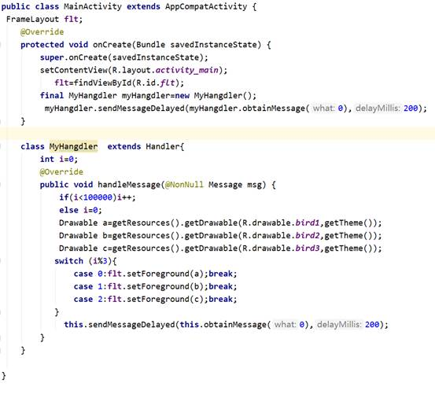

**实验5 UI（4）**

 

**一、准备知识**

**1.** **约束布局**

在2016年的`Google I/O`大会上 , `Google` 发布了`Android Studio 2.2`预览版，同时也发布了Android 新的布局方案 `ConstraintLayout` ， 但是最近的一年也没有大规模的使用。2017年Google发布了 `Android Studio 2.3` 正式版，在 `Android Studio 2.3` 版本中新建的Module中默认的布局就是 `ConstraintLayout` 。

下所示：

```
<?xml version="1.0" encoding="utf-8"?>
<android.support.constraint.ConstraintLayout
    xmlns:android="http://schemas.android.com/apk/res/android"
    xmlns:app="http://schemas.android.com/apk/res-auto"
    xmlns:tools="http://schemas.android.com/tools"
    android:layout_width="match_parent"
    android:layout_height="match_parent"
    tools:context="com.constraintlayout.app.Main2Activity">
 
</android.support.constraint.ConstraintLayout>
 
```

在使用 `ConstraintLayout` 的布局方案，需要在 `build.gradle` 引入支持库：

```
dependencies {
    compile 'com.android.support.constraint:constraint-layout:1.0.1'
}
```

传统的Android开发当中，界面基本都是靠编写XML代码完成的，虽然Android Studio也支持可视化的方式来编写界面，但是操作起来并不方便，我也一直都不推荐使用可视化的方式来编写Android应用程序的界面。

而ConstraintLayout就是为了解决这一现状而出现的。它和传统编写界面的方式恰恰相反，ConstraintLayout非常适合使用可视化的方式来编写界面，但并不太适合使用XML的方式来进行编写。当然，可视化操作的背后仍然还是使用的XML代码来实现的，只不过这些代码是由Android Studio根据我们的操作自动生成的。

另外，ConstraintLayout 还有一个优点，它可以有效地解决布局嵌套过多的问题。我们平时编写界面，复杂的布局总会伴随着多层的嵌套，而嵌套越多，程序的性能也就越差。ConstraintLayout则是使用约束的方式来指定各个控件的位置和关系的，它有点类似于 RelativeLayout，但远比RelativeLayout要更强大。

·     ConstraintLayout向下兼容 API 9

·     关于 ConstraintLayout 的基本使用方法请参照博客： 
 http://blog.csdn.net/guolin_blog/article/details/53122387

 

 

**2.** **相对布局**

RelativeLayout是一种相对布局，**控件的位置是按照相对位置来计算**的，后一个控件在什么位置依赖于前一个控件的基本位置，是布局最常用，也是最灵活的一种布局。

相对布局常用属性介绍

　　这里将这些属性分成组，便于理解和记忆。 
 　a）第一类:属性值为true或false
 　android:layout_centerHrizontal 水平居中
 　android:layout_centerVertical 垂直居中
 　android:layout_centerInparent 相对于父元素完全居中
 　android:layout_alignParentBottom 贴紧父元素的下边缘
 　android:layout_alignParentLeft 贴紧父元素的左边缘
 　android:layout_alignParentRight 贴紧父元素的右边缘
 　android:layout_alignParentTop 贴紧父元素的上边缘　　

　　b）第二类：属性值必须为id的引用名[“@id/id-name](mailto:“@id/id-name)”
 　android:layout_below 在某元素的下方
 　android:layout_above 在某元素的的上方
 　android:layout_toLeftOf 在某元素的左边
 　android:layout_toRightOf 在某元素的右边
 　android:layout_alignTop 本元素的上边缘和某元素的的上边缘对齐
 　android:layout_alignLeft 本元素的左边缘和某元素的的左边缘对齐
 　android:layout_alignBottom 本元素的下边缘和某元素的的下边缘对齐
 　android:layout_alignRight 本元素的右边缘和某元素的的右边缘对齐


 
 　c）第三类：属性值为具体的像素值，如30dip，40px
 　android:layout_marginBottom 离某元素底边缘的距离
 　android:layout_marginLeft 离某元素左边缘的距离
 　android:layout_marginRight 离某元素右边缘的距离
 　android:layout_marginTop 离某元素上边缘的距离

　　可以通过组合这些属性来实现各种各样的布局。 

 

**3.** **线性布局**

LinearLayout是一种线型的布局方式。LinearLayout布局容器内的组件**一个挨着一个地排列起来**：不仅可以控制个组件横向排列，也可控制各组件纵向排列。通过orientation属性设置线性排列的方向是**垂直(vertical)还是纵向(horizontal**)。

**4.** **表格布局**

TableLayout是指将子元素的位置分配到行或列中。Android的一个**TableLayout有许多TableRow组成**，每一个TableRow都会定义一个Row。TableLayout容器不会显示Row，Column，及Cell的边框线，每个Row拥有0个或多个Cell，每个Cell拥有一个View对象。

表格布局常见属性介绍

　　（1）TableLayout行列数的确定
     TableLayout的行数由开发人员直接指定，即有多少个TableRow对象（或View控件），就有多少行。

​    TableLayout的列数等于含有最多子控件的TableRow的列数。如第一TableRow含2个子控件，第二个TableRow含3个，第三个TableRow含4个，那么该TableLayout的列数为4.

　　（2）TableLayout可设置的属性详解
 　TableLayout可设置的属性包括全局属性及单元格属性。

　　a）全局属性也即列属性，有以下3个参数：

　　android:stretchColumns   设置可伸展的列。该列可以向行方向伸展，最多可占据一整行。

　　android:shrinkColumns   设置可收缩的列。当该列子控件的内容太多，已经挤满所在行，那么该子控件的内容将往列方向显示。

　　android:collapseColumns 设置要隐藏的列。

　　示例：

　　android:stretchColumns="0"      第0列可伸展

　　android:shrinkColumns="1,2"     第1,2列皆可收缩

　　android:collapseColumns="*"     隐藏所有行

　　说明：列可以同时具备stretchColumns及shrinkColumns属性，若此，那么当该列的内容N多时，将“多行”显示其内容。（这里不是真正的多行，而是系统根据需要自动调节该行的layout_height）

　　b）单元格属性，有以下2个参数：

　　android:layout_column   指定该单元格在第几列显示

　　android:layout_span     指定该单元格占据的列数（未指定时，为1）

　　示例：

　　android:layout_column="1"   该控件显示在第1列

　　android:layout_span="2"     该控件占据2列

　　说明：一个控件也可以同时具备这两个特性。

 

**5.** **帧布局**

FrameLayout对象好比一块在屏幕上提前预定好的空白区域，可以将一些元素填充在里面，如图片。所有元素都被放置在FrameLayout区域的最左上区域，而且无法为这些元素制指定一个确切的位置，若有多个元素，那么后面的元素会**重叠显示**在前一个元素上。

FrameLayout单帧布局可以说毫无价值！由于 FrameLayout 中后出现的 UI 控件会覆盖前面出现的 UI 控件，每次只能显示一个 UI 控件，因此，我们可以通过在 Activity 中对每次显示的图片内容进行切换以**实现动画效果** 。

**二、作业**

1、 创建4个窗口：MainActivity、LNActivity、TBActivity和FRActivity，为MainActivity的添加radiobutton和button，在button的onclick事件添加代码，使得用户在选择radiobutton时，能够跳转到下一个目标窗口（和work4相似）。


 

2、实现linearlayout布局。编辑LNActivity窗口，去掉窗口的默认布局，为窗口添加一个linearlayout，垂直布局。再为其添加两个子linearlayout，垂直布局，并且各自比重weight都为1，实现“日”字布局。在上linearlayout添加3个textview，

各自比重weight都为1，中心水平对齐。在下linearlayout添加1个button，中心水平对齐。


为LNActivity.java添加代码，实现点击按钮改变上linearlayout的布局：


 

 

 

 

3、实现tablelayout布局。编辑TBActivity窗口，去掉窗口的默认布局，为窗口添加一个tablelayout。插入一个tablerow，往里面添加一个显示“用户名”的textview，再插入一个edittext，用于用户名输入。再插入下一个tablerow……一直操作下去，完成之前我们work3的功能。（为让登录按钮位置对齐，可在其前面插入一个空白占位space）


4、实现framelayout布局。将素材图片放进res/drawable-hdpi文件夹内，编辑FRActivity窗口，去掉窗口的默认相对布局，为窗口添加一个framelayout，设置前景为bird1.gif。

 


 

通过不停地改变framelayout的前景图片，实现一个小鸟飞翔的动画效果。或许你会想到开启一条线程来控制切换 ， 但在非主线程中不能更新 UI 界面 ， 所以 ， 我们使用了Android 提供的消息通讯类 Handler 。该类可以实现非主线程和负责 UI 的主线程之间的通信 ，进而间接实现非主线程更新 UI 界面。

调用sendMessageDelayed(obtainMessage(0), delayMillis); 方法，控制框架传递消息给handleMessage 事件的延迟时间 ， 我们在 handleMessage() 方法中再次调用endMessageDelayed方法 ，形成一个循环调用 。前景图片也会不断的切换，进而实现动画的效果。



 

 