**实验6 UI（5）**

 

**一、准备知识**

 

**1.** **菜单**

**（1）**  **使用****xml****定义****Menu**

**在****Android****工程目录下的****res****包下，右键选择****New****菜单项下的****Android resource directory,****并以****menu****命名文件夹的名字；右键****menu****文件夹，选择****Menu resource file****选项****,****创建****main_menu.xml****文件，菜单资源文件就创建在****res/menu****目录中。**

菜单资源文件必须使用<menu>标签作为根节点。除了<menu>标签外，还有另外两个标签用于设置菜单项和分组，这两个标签是<item>和<group>。

<menu>标签没有任何属性，但可以嵌套在<item>标签中，表示子菜单的形式。不过<item>标签中不能再嵌入<item>标签。

**（****2****）****<item>****标签的属性含义如下****:**

Id：表示菜单项的资源ID

menuCategory：同种菜单项的种类。该属性可取4个值：container、system、secondary和alternative。通过menuCategroy属性可以控制菜单项的位置。例如将属性设为system，表示该菜单项是系统菜单，应放在其他种类菜单项的后面。

orderInCategor:同种类菜单的排列顺序。该属性需要设置一个整数值。例如menuCategory属性值都为system的3个菜单项(item1、item2和item3)。将这3个菜单项的orderInCategory属性值设为3、2、1，那么item3会显示在最前面，而item1会显示在最后面。

title：菜单项标题(菜单项显示的文本)

titleCondensed：菜单项的短标题。当菜单项标题太长时会显示该属性值

icon：菜单项图标资源ID

alphabeticShortcut:菜单项的字母快捷键

numericShortcut：菜单项的数字快捷键

checkable：表示菜单项是否带复选框。该属性可设计为true或false

checked：如果菜单项带复选框(checkable属性为true)，该属性表示复选框默认状态是否被选中。可设置的值为true或false

visible：菜单项默认状态是否可视

enable：菜单项默认状态是否被激活

**（****3****）****<group>****标签的属性含义如下：**

id:表示菜单组的ID

menuCategory：与<item>标签的同名属性含义相同。只是作用域为菜单组

orderInCategory：与<item>标签的同名属性含义相同。只是作用域为菜单组

checkableBehavior：设置该组所有菜单项上显示的选择组件(CheckBox或Radio Button)。如果将该属性值设为all，显示CheckBox组件；如果设为single，显示Radio Button组件；如果设为none，显示正常的菜单项(不显示任何选择组件)。all(non-exclusive/checkboxes),single(exclusive/radiobuttons).

visible：表示当前组中所有菜单项是否显示。该属性可设置的值是true或false

enable：表示当前组中所有菜单项是否被激活。该属性可设置的值是true或false

 

**2.** **功能菜单**

options menu   按Menu键就会显示，用于当前的Activity。

  它包括两种菜单项：

​     因为options menu在屏幕底部最多只能显示6个菜单项，这些菜单项称为icon menu，icon menu只支持文字(title) 以及icon，可以设置快捷键，不支持checkbox以及radio控件，所以不能设置checkable选项。

​     而多于6的菜单项会以“more” icon menu来调出，称为expanded menu。它不支持icon，其他的特性都和icon menu一样！

在Activity里面，一般通过以下函数来使用options menu：

   Activity::onCreateOptionsMenu (Menu menu)  创建options menu，这个函数只会在menu第一次显示时调用。

   Activity::onPrepareOptionsMenu (Menu menu) 更新改变options menu的内容，这个函数会在menu每次显示时调用。

   Activity::onOptionsItemSelected (MenuItem item) 处理选中的菜单项。

 

**3.** **上下文菜单**

context menu   要在相应的view上按几秒后才显示的，用于view，跟某个具体的view绑定在一起。这类型的菜单不支持icon和快捷键！

在Activity里面，一般通过以下函数来使用context menu：

   Activity::registerForContextMenu(View view) 为某个view注册context menu，一般在Activity::onCreate里面调用。

  Activity::onCreateContextMenu(ContextMenu menu, View v, ContextMenu.ContextMenuInfo menuInfo) 创建context menu，和options menu不同，context meun每次显示时都会调用这个函数。

  Activity::onContextItemSelected(MenuItem item) 处理选中的菜单项。

 

 

**4.** **子菜单**

 

以上两种menu都可以加入子菜单，但子菜单不能嵌套子菜单，这意味着在Android系统，菜单只有两层，设计时需要注意的！同时子菜单不支持icon。

 

**5.** **动态菜单**

动态菜单就是根据不同的情况代码生成的不同菜单。这时候就不再直接在xml里先定义好了，要在代码中动态添加菜单项。

在android中创建菜单menu时需要重写Activity的onCreateOptionsMenu(Menumenu)方法，在这个方法中实现菜单xml的关联。这个方法只在第一次创建的时候调用一次，所以如果之后想对menu进行动态的修改，那么就不能用它了。这时,就要用到onPrepareOptionsMenu(Menumenu)方法。

onPrepareOptionsMenu与onCreateOptionsMenu不同的是，他在每次按下menu硬键之前会被调用，所以可以在这里动态的改变menu。

代码中添加菜单项的方法：menu.add(groupId, itemId, order, title)

groupld 这个菜单的组别

itemid 是用来获取这个指定菜单项的

order就是这个组别的第几项，0为第一项

title是显示的标题

 

**二、作业** 

1、 创建4个窗口：MainActivity、OPMENUActivity、CTMENUActivity和POPActivity、为MainActivity的添加radiobutton和button，在button的onclick事件添加代码，使得用户在选择radiobutton时，能够跳转到下一个目标窗口。

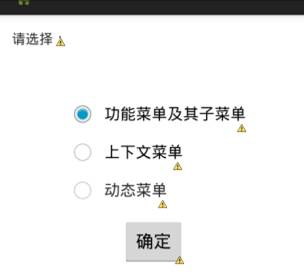

 

2、实现功能菜单和子菜单：选择你的系别和专业。

(1)编辑OPMENUActivity窗口，为textview添加id为optv，修改文本为“请点击菜单”。

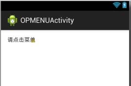

(2)创建菜单项资源文件res/menu/opmenu.xml：

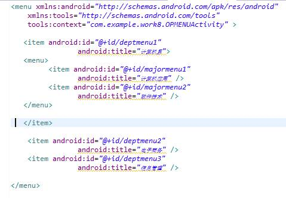

 

(2)为OPMENUActivity.java添加代码：

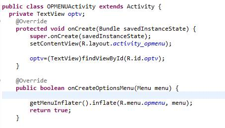

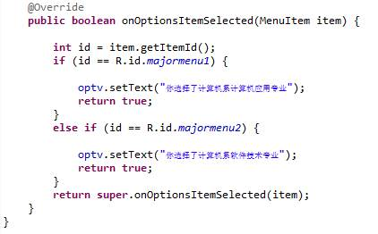

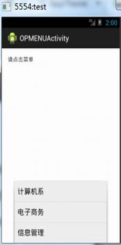

 

 

 

 

 

 

3、实现上下文菜单：选择你想要的水果

(1) 编辑CTENUActivity窗口，为textview添加id为cttv，修改文本为“请长按按钮”。添加一个button，id为btpush。

(2) 创建菜单项资源文件res/menu/ctmenu.xml：

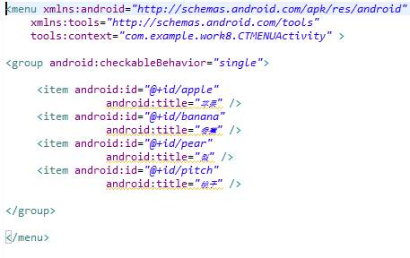

(3)为CTMENUActivity.java添加代码：

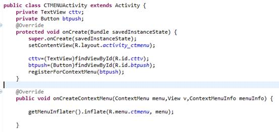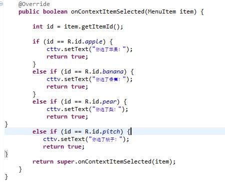

 

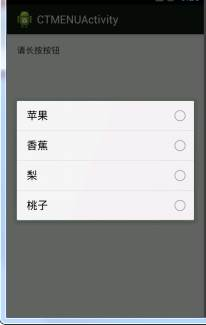

4、实现动态菜单：选择不同的专业时，会出现不同的功能菜单。

(1) 编辑POPActivity窗口，为textview添加id为poptv，修改文本为“软件技术”。

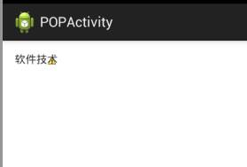

（2）修改资源文件res/menu/po.xml，由于是动态生成菜单项，我们只留个空菜单：

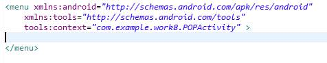

（3）为POPActivity.java添加代码：

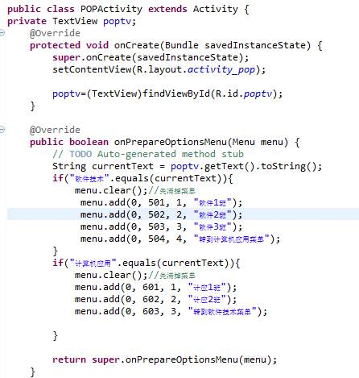

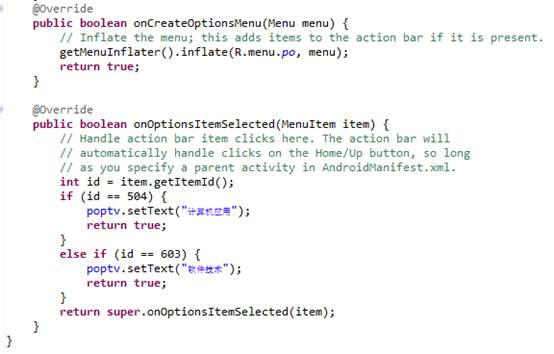

 

 