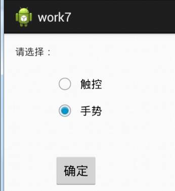
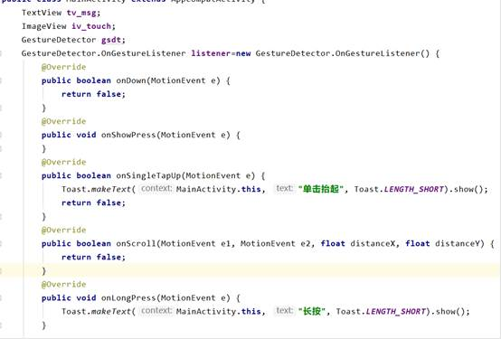

**实验7 UI（6）**

 

**一、准备知识**

 

**1.** **触控**

  现在一般的android手机都会使用电容触摸屏，所以基本上都会支持单点和多点触控，同样在android系统中应用程序可以使用触控的事件来完成各种手势和场景需求。实现触摸屏相关的事件，首先要实现OnTouchListener接口，然后重写方法：

public boolean onTouch(View v, MotionEvent event);

View v是触发事件的源，MotionEvent event即一个触摸事件。对屏幕的几乎所有操作都会触发事件，如点击、放开、滑动等。

触控分单点和多点触控，由于实验条件的限制，我们这里只讨论单点触控。

不同的事件在MotionEvent中有不同的id，我们可以根据event.getAction()的结果来判断是何种事件。

·     MotionEvent.ACTION_DOWN：在第一个点被按下时触发

·     MotionEvent.ACTION_UP:当屏幕上唯一的点被放开时触发

·     MotionEvent.ACTION_MOVE： 当有点在屏幕上移动时触发。值得注意的是，由于它的灵敏度很高，而我们的手指又不可能完全静止（即使我们感觉不到移动，但其实我们的手指也在不停地抖 动），所以实际的情况是，基本上只要有点在屏幕上，此事件就会一直不停地被触发。

另外还有很多辅助接口：

\1.  event.getPointerCount() 获取当前触控点的数量  

\2.  event.getX(i) 获取指定触控点的X坐标  

\3.  event.getY(i) 获取指定触控点的Y坐标  

\4.  event.getPressure(i) 获取指定触控点的压力值，此值的获取需要LCD硬件和驱动的支持 

 

 

**2.** **手势**

**（1）** **简单手势**

当用户触摸屏幕的时候，会产生许多手势，例如down，up，scroll，filing等等。一般情况下，我们知道View类有个View.OnTouchListener内部接口，通过重写他的onTouch(View v, MotionEvent event)方法，我们可以处理一些touch事件，但是这个方法太过简单，如果需要处理一些复杂的手势，用这个接口就会很麻烦（因为我们要自己根据用户触摸的轨迹去判断是什么手势）。

Android sdk给我们提供了**GestureDetector**（Gesture：手势Detector：识别）类，通过这个类我们可以识别很多的手势，主要是通过他的onTouchEvent(event)方法完成了不同手势的识别。虽然他能识别手势，但是不同的手势要怎么处理，应该是提供给程序员实现的。

GestureDetector这个类对外提供了两个接口和一个外部类

**接口：OnGestureListener，OnDoubleTapListener**

**外部类:SimpleOnGestureListener**

这个类，其实是两个接口中所有函数的集成，它包含了这两个接口里所有必须要实现的函数而且都已经重写，但所有方法体都是空的；不同点在于：该类是static class，程序员可以在外部继承这个类，重写里面的手势处理方法。

**我们主要学习****OnGestureListener****接口：**

**该接口总共重写了六个函数，这些函数都在什么情况下才会触发呢，下面讲一下：**

OnDown(MotionEvent e)：用户按下屏幕就会触发；

onShowPress(MotionEvent e)：如果是按下的时间超过瞬间，而且在按下的时候没有松开或者是拖动的，那么onShowPress就会执行，具体这个瞬间是多久，我也不清楚呃……

onLongPress(MotionEvent e)：长按触摸屏，超过一定时长，就会触发这个事件

  触发顺序：

  onDown->onShowPress->onLongPress

onSingleTapUp(MotionEvent e)：从名子也可以看出,一次单独的轻击抬起操作,也就是轻击一下屏幕，立刻抬起来，才会有这个触发，当然,如果除了Down以外还有其它操作,那就不再算是Single操作了,所以也就不会触发这个事件

  触发顺序：

  点击一下非常快的（不滑动）Touchup：

  onDown->onSingleTapUp->onSingleTapConfirmed 

  点击一下稍微慢点的（不滑动）Touchup：

  onDown->onShowPress->onSingleTapUp->onSingleTapConfirmed

onFling(MotionEvent e1, MotionEvent e2, float velocityX,float velocityY) ：滑屏，用户按下触摸屏、快速移动后松开，由1个MotionEvent ACTION_DOWN, 多个ACTION_MOVE, 1个ACTION_UP触发  

   参数解释：

  e1：第1个ACTION_DOWN MotionEvent

  e2：最后一个ACTION_MOVE MotionEvent

  velocityX：X轴上的移动速度，像素/秒

  velocityY：Y轴上的移动速度，像素/秒  

onScroll(MotionEvent e1, MotionEvent e2,float distanceX, float distanceY)：在屏幕上拖动事件。无论是用手拖动view，或者是以抛的动作滚动，都会多次触发,这个方法    在ACTION_MOVE动作发生时就会触发

  滑屏：手指触动屏幕后，稍微滑动后立即松开

  onDown-----》onScroll----》onScroll----》onScroll----》………----->onFling

  拖动

  onDown------》onScroll----》onScroll------》onFiling

  **可见，无论是滑屏，还是拖动，影响的只是中间OnScroll触发的数量多少而已，最终都会触发onFling事件！**

**（2）自定义手势**

在Android系统中，用户可以使用很多不同的触控方式来下命令，这些叫做手势。用户可以自己定义手势，存于手势数据库文件，然后再用于日后开发项目中，通过手势比对和识别来下命令。手势比对是通过OnGesturePerformedListener接口来实现的。通过重写OnGesturePerformed方法，将现场绘制的手势与手势库里的手势比对，获得若干个相似手势，取出最相似的手势。

 

**二、作业**

 **模拟器设置：将与创建手势要用到SD卡，所以打开模拟器之前请将它的的SD容量修改为128M或者更大。**

1、 创建3个窗口：MainActivity、TouchActivity、GesturesActivity、为MainActivity的添加radiobutton和button，在button的onclick事件添加代码，使得用户在选择radiobutton时，能够跳转到下一个目标窗口。

2、实现触控例子：获取一张图片范围内的坐标。

(1)编辑TouchActivity窗口，为textview添加id，修改文本为“Not Touch !”，在textView下方添加一个imageview，并引用一张图片（之前已做过，过程你懂的！）。

 

(2)为TouchActivity.java添加代码：

运行如下:

3、实现手势匹配评分。

(1)编辑GesturesActivity窗口，为textview添加id，修改文本为“请输入手势”。

(2)创建手势，并使用DDMS将手势数据库文件考到我们项目的制定文件夹下res/raw（自己新建此文件夹）

(3)在GesturesActivity的布局XML文件中创建手势绘制组件gestureoverlayview，此组件如果工具栏没有，可以手动在xml中添加。

（4）为GesturesActivity.java添加代码：

 

 

 

 

 

 

 

 

 

 

 

 

 

 

 

