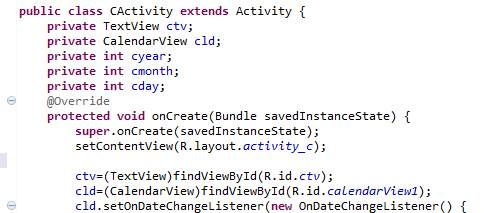
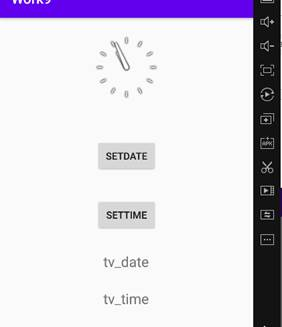
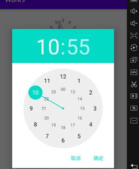

**实验8 UI（7）**

 

**一、准备知识**

**1.** **CalendarView**

**在****Android****平台****3.0****中才新增了日历视图控件，可以显示网格状的日历内容，那么对于****Android 3.0****以下的版本要使用日历控件只能借助第三方，目前用的最多的是****CalendarView****。**

　**CalendarView****是从****android.widget.FrameLayout****中继承的。**

　**CalendarView** **类提供了基本的日历设置方法：**

```
long getDate();  //获取从1970年，1月1日，0点0分0秒到现在的毫秒数，因为返回是long型最终只能截止到2038年
    int getFirstDayOfWeek();  //获取当天是本周的第几天，Android123提示返回的定义在java.util.Calendar类中，比如Calendar.Monday为星期一，定义值为2。   
    long getMaxDate();  //获取CalendarView支持1970年到那天的最大天数    
    long getMinDate(); //获取CalendarView支持1970年到那天的最小天数    
    boolean getShowWeekNumber();  //获取是否显示星期号     
    boolean isEnabled();  //是否显示本日历视图    
    public void setDate(long date, boolean animate, boolean center); //设置选择日期到1970年的描述  
    void setDate(long date); //设置选择的日期描述到1970年    
    void setEnabled(boolean enabled); //设置是否启用视图  
    void setFirstDayOfWeek(int firstDayOfWeek);  //设置本周起始天数   
    void setMaxDate(long maxDate);   
    void setMinDate(long minDate);   
    void setOnDateChangeListener(CalendarView.OnDateChangeListener listener);   //日历视图修改的接口，这个介绍看下面。   
    void setShowWeekNumber(boolean showWeekNumber); //设置是否显示周号
```

有关日历控件CalendarView的设置接口 android.widget.CalendarView.OnDateChangeListener 只实现了一个回调方法void onSelectedDayChange(CalendarView view, int year, int month, int dayOfMonth)。

　　这四个参数的具体介绍为:

　　view：CalendarView对象。

　　year：要设置的年。

　　month：要设置的月份，范围是0-11。

　　dayOfMonth：要设置每月的某一天。

**2.** **AlertDialog**

AlertDialog是Dialog的一个直接子类，AlertDialog也是Android系统当中最常用的对话框之一。一个AlertDialog可以有两个Button或3个Button，可以对一个AlertDialog设置title和message.

不能直接通过AlertDialog的构造函数来生成一个AlertDialog.一般生成AlertDialog的时候都是通过它的一个内部静态类AlertDialog.builder来构造的。

 

要创建一个AlertDialog，就要用到AlertDialog.Builder中的create()方法。

　　使用AlertDialog.Builder创建对话框需要了解以下几个方法：

　　　　setTitle ：为对话框设置标题
 　　　setIcon ：为对话框设置图标
 　　　setMessage：为对话框设置内容
 　　　setView ： 给对话框设置自定义样式
 　　　setItems ：设置对话框要显示的一个list，一般用于显示几个命令时
 　　　setMultiChoiceItems ：用来设置对话框显示一系列的复选框
 　　　setNeutralButton ：普通按钮

　　　　setPositiveButton ：给对话框添加"Yes"按钮
 　　　setNegativeButton ：对话框添加"No"按钮
 　　　create ： 创建对话框
 　　　show ：显示对话框

例子：一个删除警告框

\1.     Builder dialog = **new** AlertDialog.Builder(**this**);  

\2.      dialog.setTitle("确定删除？");  

\3.      dialog.setMessage("您确定删除该条信息吗？");  

\4.      dialog.setIcon(R.drawable.ic_launcher);  

\5.      //为“确定”按钮注册监听事件  

\6.      dialog.setPositiveButton("确定", **new** DialogInterface.OnClickListener() {  

\7.        @Override 

\8.        **public** **void** onClick(DialogInterface dialog, **int** which) {  

\9.           // 根据实际情况编写相应代码。  

\10.        }  

\11.     });  

\12.     //为“取消”按钮注册监听事件  

\13.     dialog.setNegativeButton("取消", **new** DialogInterface.OnClickListener() {  

\14.        @Override 

\15.        **public** **void** onClick(DialogInterface dialog, **int** which) {  

\16.          // 根据实际情况编写相应代码。  

\17.        }  

\18.     });  

\19.     //为“查看详情”按钮注册监听事件  

\20.     dialog.setNeutralButton("查看详情", **new** DialogInterface.OnClickListener() {  

\21.        @Override 

\22.        **public** **void** onClick(DialogInterface dialog, **int** which) {  

\23.          // 根据实际情况编写相应代码。  

\24.        }  

\25.     });  

\26.     dialog.create();  

\27.     dialog.show();  

  

 

**3.** **DatePickerDialog**

如同calendarview一样，设置日期我们还可以使用DatePicker 日期选择控件，但这两者都是静态的生成控件，即跟着Ativity一起初始化的。如果我们要实现动态的、很炫的弹出日期选择对话框的效果，那就应该使用DatePickerDialog控件了。DatePickerDialog就是简单的封装了DatePicker的Dialog.

  我们可以实现DatePickerDialog.OnDateSetListener接口，使得日期选择的设置按钮按下有效。

 

 

**4.** **TimePickerDialog**

用法和DatePickerDialog一样，只是在初始化和使用接口方面的名称和参数有细微的出入，比如TimePickerDialog接收的是小时和分钟两个参数，而DatePickerDialog是年月日三个。

 

 

 

**二、作业** 

1、 创建3个窗口：MainActivity、CActivity和DActivity为MainActivity的添加radiobutton和button，在button的onclick事件添加代码，使得用户在选择radiobutton时，能够跳转到下一个目标窗口。


 

2、实现日历选择和警告。

（1）编辑CActivity窗口，为textview添加id为ctv。拖进一个CalendarView。

 


 (2)为CActivity.java添加代码：



 


 


 

 

 

 

 

 

3、实现日期选择对话框和时间选择对话框。

(1) 编辑DActivity窗口，添加2个textview，分别其为添加id为tv_date、tv_time。添加一个anlogclock（这个需要手动敲布局代码添加）。添加2个button，id为bt_date和bt_time。


 

(2)为DActivity.java添加代码：


 


 

 

 

 

 

效果：



