**实验9 UI（8）**

 

**一、准备知识**

 

**1、** **AlarmManager****，顾名思义，就是****“****提醒****”****，是****Android****中常用的一种系统级别的提示服务，可以实现从指定时间开始，以一个固定的间隔时间执行某项操作，所以常常与广播（****Broadcast****）连用，实现闹钟等提示功能**

 

**AlarmManager****的常用方法有三个：**

 

**（****1****）****set(int type****，****long startTime****，****PendingIntent pi)****；**

**该方法用于设置一次性闹钟，第一个参数表示闹钟类型，第二个参数表示闹钟执行时间，第三个参数表示闹钟响应动作。**

 

**（****2****）****setRepeating(int type****，****long startTime****，****long intervalTime****，****PendingIntent pi)****；**

**该方法用于设置重复闹钟，第一个参数表示闹钟类型，第二个参数表示闹钟首次执行时间，第三个参数表示闹钟两次执行的间隔时间，第三个参数表示闹钟响应动作。**

 

**（****3****）****setInexactRepeating****（****int type****，****long startTime****，****long intervalTime****，****PendingIntent pi****）；**

 **该方法也用于设置重复闹钟，与第二个方法相似，不过其两个闹钟执行的间隔时间不是固定的而已。**

 

**三个方法各个参数详悉：**

 

**（****1****）****int type****：闹钟的类型，常用的有****5****个值：****AlarmManager.ELAPSED_REALTIME****、****AlarmManager.ELAPSED_REALTIME_WAKEUP****、****AlarmManager.RTC****、****AlarmManager.RTC_WAKEUP****、****AlarmManager.POWER_OFF_WAKEUP****。**

 

**AlarmManager.ELAPSED_REALTIME****表示闹钟在手机睡眠状态下不可用，该状态下闹钟使用相对时间（相对于系统启动开始），状态值为****3****；**

**AlarmManager.ELAPSED_REALTIME_WAKEUP****表示闹钟在睡眠状态下会唤醒系统并执行提示功能，该状态下闹钟也使用相对时间，状态值为****2****；**

**AlarmManager.RTC****表示闹钟在睡眠状态下不可用，该状态下闹钟使用绝对时间，即当前系统时间，状态值为****1****；**

**AlarmManager.RTC_WAKEUP****表示闹钟在睡眠状态下会唤醒系统并执行提示功能，该状态下闹钟使用绝对时间，状态值为****0****；**

**AlarmManager.POWER_OFF_WAKEUP****表示闹钟在手机关机状态下也能正常进行提示功能，所以是****5****个状态中用的最多的状态之一，该状态下闹钟也是用绝对时间，状态值为****4****；不过本状态好像受****SDK****版本影响，某些版本并不支持；**

 

**（****2****）****long startTime****：闹钟的第一次执行时间，以毫秒为单位，可以自定义时间，不过一般使用当前时间。需要注意的是，本属性与第一个属性（****type****）密切相关，如果第一个参数对应的闹钟使用的是相对时间（****ELAPSED_REALTIME****和****ELAPSED_REALTIME_WAKEUP****），那么本属性就得使用相对时间（相对于系统启动时间来说），比如当前时间就表示为：****SystemClock.elapsedRealtime()****；如果第一个参数对应的闹钟使用的是绝对时间（****RTC****、****RTC_WAKEUP****、****POWER_OFF_WAKEUP****），那么本属性就得使用绝对时间，比如当前时间就表示为：****System.currentTimeMillis()****。**

 

**（****3****）****long intervalTime****：对于后两个方法来说，存在本属性，表示两次闹钟执行的间隔时间，也是以毫秒为单位。**

 

**（****4****）****PendingIntent  pi****：是闹钟的执行动作，比如发送一个广播、给出提示等等。****PendingIntent****是****Intent****的封装类。**

**需要注意的是：** 

**如果是通过启动服务来实现闹钟提示的话，****PendingIntent****对象的获取就应该采用****Pending.getService(Context c,int i,Intent intent,int j)****方法；**

**如果是通过广播来实现闹钟提示的话，****PendingIntent****对象的获取就应该采用****PendingIntent.getBroadcast(Context c,int i,Intent intent,int j)****方法；**

**如果是采用****Activity****的方式来实现闹钟提示的话，****PendingIntent****对象的获取就应该采用****PendingIntent.getActivity(Context c,int i,Intent intent,int j)****方法。**

**如果这三种方法错用了的话，虽然不会报错，但是看不到闹钟提示效果。**

 

**AlarmManager****的使用机制有的称呼为全局定时器，有的称呼为闹钟。通过对它的使用，个人觉得叫全局定时器比较合适，其实它的作用和****Timer****有点相似。都有两种相似的用法：（****1****）在指定时长后执行某项操作（****2****）周期性的执行某项操作**

 

**AlarmManager****对象配合****Intent****使用，可以定时的开启一个****Activity,****发送一个****BroadCast,****或者开启一个****Service.**

 

**2****、****MediaPlayer**

**MediaPlayer****还有多种使用方式和方法，具体来看：**

**1****）如何获得****MediaPlayer****实例：**

  **可以使用直接****new****的方式：**

  **MediaPlayer mp = new MediaPlayer();**

  **也可以使用****create****的方式，如：**

**MediaPlayer mp = MediaPlayer.\*create\*(this, R.raw.\*test\*);//****这时就不用调用****setDataSource****了**

 

**2)** **如何设置要播放的文件：**

  **MediaPlayer****要播放的文件主要包括****3****个来源：**

**a.** **用户在应用中事先自带的****resource****资源**

  **例如：****MediaPlayer.\*create\*(this, R.raw.\*test\*);**

**b.** **存储在****SD****卡或其他文件路径下的媒体文件**

**例如：****mp.setDataSource(" ……./sdcard/test.mp3");**

**c.** **网络上的媒体文件**

**例如：****mp.setDataSource("http://www.citynorth.cn/music/confucius.mp3");**

 

**MediaPlayer****的****setDataSource****一共四个方法：**

​    **setDataSource (String path)**

​    **setDataSource (FileDescriptor fd)**

​    **setDataSource (Context context, Uri uri)**

  **setDataSource (FileDescriptor fd, long offset, long length)**

 

**3****）对播放器的主要控制方法：**

**Android****通过控制播放器的状态的方式来控制媒体文件的播放，其中：**

**prepare()****和****[prepareAsync()](http://blog.csdn.net/ddna/article/details/Android/android-sdk-windows-1.5_r3/docs/reference/android/media/MediaPlayer.html#prepareAsync())** **提供了同步和异步两种方式设置播放器进入****prepare****状态，需要注意的是，如果****MediaPlayer****实例是由****create****方法创建的，那么第一次启动播放前不需要再调用****prepare****（）了，因为****create****方法里已经调用过了。**

**start()****是真正启动文件播放的方法，**

**pause()****和****stop()****比较简单，起到暂停和停止播放的作用，**

**[seekTo()](file:///F:/Android/android-sdk-windows-1.5_r3/docs/reference/android/media/MediaPlayer.html#seekTo(int))****是定位方法，可以让播放器从指定的位置开始播放，需要注意的是该方法是个异步方法，也就是说该方法返回时并不意味着定位完成，尤其是播放的网络文件，真正定位完成时会触发****OnSeekComplete.onSeekComplete()****，如果需要是可以调用****setOnSeekComplete**

**-Listener(OnSeekCompleteListener)****设置监听器来处理的。**

**release()****可以释放播放器占用的资源，一旦确定不再使用播放器时应当尽早调用它释放资源。**

**[reset()](file:///F:/Android/android-sdk-windows-1.5_r3/docs/reference/android/media/MediaPlayer.html#reset())****可以使播放器从****Error****状态中恢复过来，重新会到****Idle****状态。**

 

**4****）设置播放器的监听器：**

  **MediaPlayer****提供了一些设置不同监听器的方法来更好地对播放器的工作状态进行监听，以期及时处理各种情况，**

**如：** **[setOnCompletionListener](http://blog.csdn.net/ddna/article/details/Android/android-sdk-windows-1.5_r3/docs/reference/android/media/MediaPlayer.html#setOnCompletionListener(android.media.MediaPlayer.OnCompletionListener))([MediaPlayer.OnCompletionListener](http://blog.csdn.net/ddna/article/details/Android/android-sdk-windows-1.5_r3/docs/reference/android/media/MediaPlayer.OnCompletionListener.html) listener)****、**

**[setOnErrorListener](http://blog.csdn.net/ddna/article/details/Android/android-sdk-windows-1.5_r3/docs/reference/android/media/MediaPlayer.html#setOnErrorListener(android.media.MediaPlayer.OnErrorListener))([MediaPlayer.OnErrorListener](http://blog.csdn.net/ddna/article/details/Android/android-sdk-windows-1.5_r3/docs/reference/android/media/MediaPlayer.OnErrorListener.html) listener)****等****,****设置播放器时需要考虑到播放器可能出现的情况设置好监听和处理逻辑，以保持播放器的健壮性。**

 

 

 

 

**二、作业** 

1、 创建2个窗口：MainActivity、ALMActivity（此Activity作为闹钟响时显示警告框的载体），将work8中的DActivity布局搬到MainActivity，在此基础上多添加1个switch和一个textview控件，用于设置闹钟和取消闹钟以及显示闹钟时间，ID分别为sw_set和tv_status。

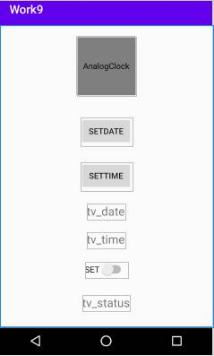

2、使用设备管理器，导入闹钟铃声getup.mp3到/sdcard/Alarms/路径下并

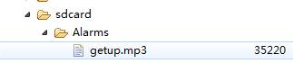

3、添加读写外部存储权限。

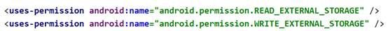

4、为MainActivity.java添加代码：

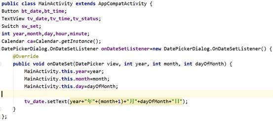

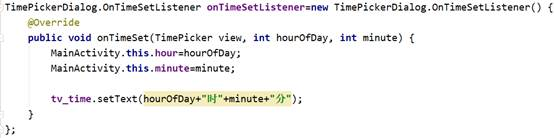

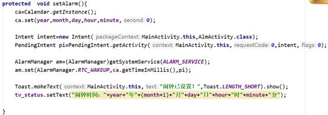

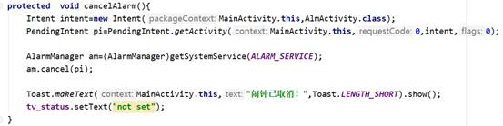

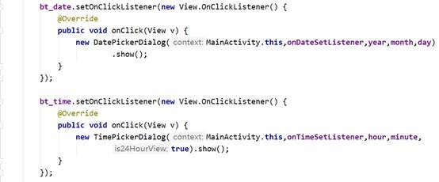

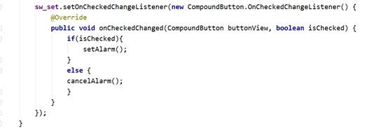

5、为ALMActivity.java添加代码：

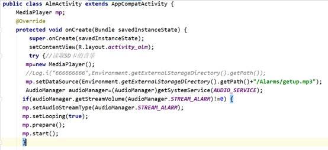

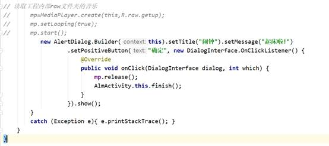

 

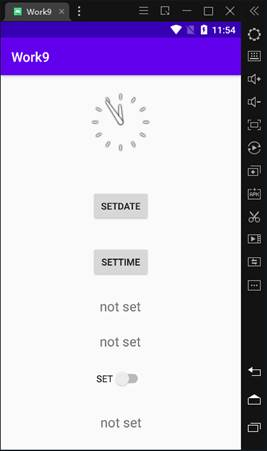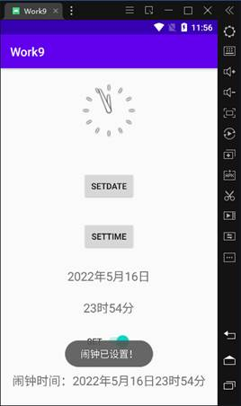

